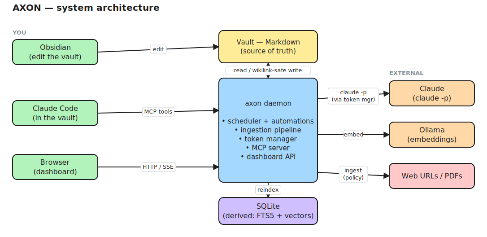
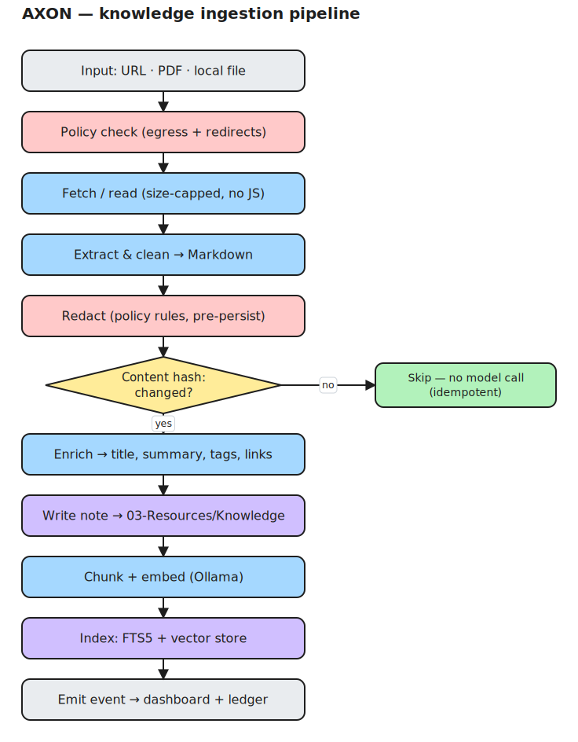
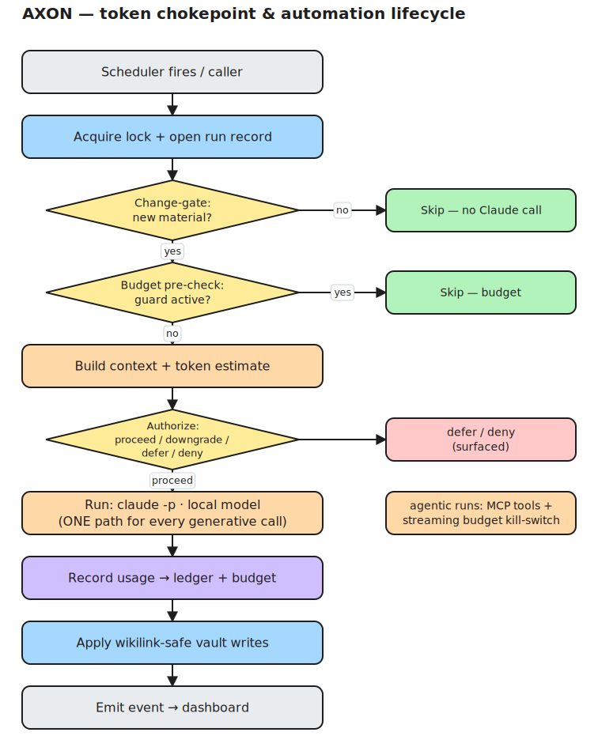
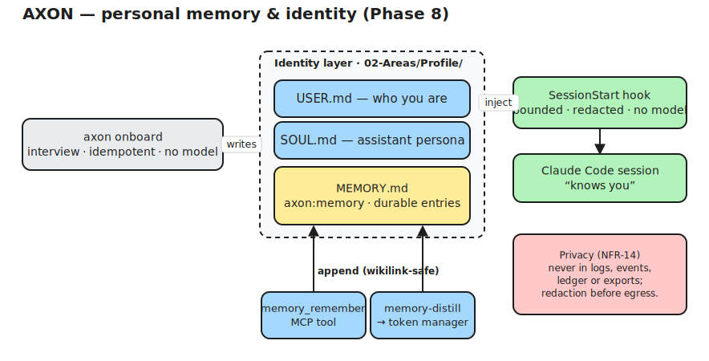

# AXON — A Local-First AI Operating System for Obsidian

[](LICENSE)
[](go.mod)
[](.github/workflows/ci.yml)
[](#build--run)

> **Status:** Implemented (Phases 0–8). A single Go binary + an embedded React/Recharts dashboard.
> **Module:** `github.com/jandro-es/axon` · **Go 1.26+** · pure-Go SQLite (no cgo).

AXON turns an Obsidian vault into a **second brain that maintains itself**. It is a local-first runtime that wires **Claude** and **Claude Code** into your vault, runs configurable automations (heartbeats, daily logs, compaction, exports, re-indexing), ingests external knowledge (articles, URLs, PDFs), accounts for every token it spends, and surfaces everything on a real-time local dashboard.

It is designed to be **cloned, configured with a handful of values, and stood up with one command** — twice over, in fact: a `personal` profile and a `work` profile, on different machines, under different Claude accounts and different restriction policies.

> 📖 **New here? Start with the [Installation, Setup & Usage Guide](docs/GUIDE.md)** — a complete walkthrough from a clean machine to a running system.

## Two cardinal rules (enforced in code)

1. **No Claude call bypasses the token manager.** Every path to Claude goes through the Component-07 chokepoint: pre-flight estimate → budget check → run → ledger. The only Claude adapter is `claude -p` (subscription/enterprise) reached via `tokens.Manager.Run`.
2. **No vault mutation that isn't wikilink-safe.** Renames go through `vault.move` (rewrites inbound links); content edits land in `axon:*` managed blocks via `vault.patch`; new notes via `vault.write`. There is **no** `vault.delete`. The vault FS is sandboxed against path traversal.

## How it fits together



The vault (Markdown) is durable memory; the **axon daemon** is the runtime around
it; **Claude** (via Claude Code) is the brain and **Ollama** does local
embeddings. SQLite is derived and disposable. *(Diagrams are editable —
[architecture.excalidraw](docs/diagrams/architecture.excalidraw) — open at
[excalidraw.com](https://excalidraw.com).)*

---

## Build & run

```bash
git clone https://github.com/jandro-es/axon.git && cd axon
cp axon.config.example.yaml axon.config.yaml   # set vault_path, profile, budgets (≤ 6 values)
cp .env.example .env                           # CLAUDE_CODE_OAUTH_TOKEN from `claude setup-token`

(cd web && npm install && npm run build)       # build the dashboard SPA (Node, build-time only)
go build -o axon ./cmd/axon                     # single self-contained binary (SPA embedded)

./axon config validate                          # check the config
./axon init                                     # scaffold vault + DB + .claude wiring + dashboards (idempotent)
./axon doctor                                   # prerequisites health check
./axon start                                    # scheduler + dashboard at http://127.0.0.1:7777
```

Prerequisites: the `claude` CLI (logged in for your `auth_mode`), and **Ollama** for local embeddings. `go build` works without the SPA build (it serves a fallback page until `web/dist` exists).

`AXON_PROFILE=work axon init` provisions the **work** profile (Claude Enterprise SSO) on the work machine. Personal and work are separate installations, fully isolated — inspect with `axon profiles`.

---

## Commands

| Command | What it does |
|---------|--------------|
| `axon init` | Idempotently provision the profile: data dir, DB, embedding check, vault scaffold, `.claude/` (CLAUDE.md, `.mcp.json`, hooks, plugin), Dataview dashboards, first index. |
| `axon doctor` | Prerequisite checks: config, stray `ANTHROPIC_API_KEY`, `claude`/`ollama`, vault writable, port free, residency. |
| `axon config validate` | Validate `axon.config.yaml`. |
| `axon reindex [--embeddings]` | Rebuild the notes mirror + link graph from the vault (ADR-006); `--embeddings` re-embeds. |
| `axon ingest <url\|path> [--dry-run]` | Policy-gated fetch → clean → redact → summarise → write → chunk → embed → index. |
| `axon search <query> [--top-k]` | Hybrid lexical (FTS5) + semantic (vector) search. |
| `axon status [--json]` | Remaining day/week token budget + guard state. |
| `axon run <automation> [--dry-run]` | Run one automation through the engine (same path as the scheduler). |
| `axon start [--no-dashboard]` | The daemon: scheduler + live SSE dashboard. |
| `axon mcp` | The AXON MCP server over stdio (launched by Claude Code). |
| `axon hook <event>` | Deterministic in-session hook handler (internal). |
| `axon service <install\|uninstall\|print>` | Emit/install an OS service unit (launchd/systemd/Task Scheduler). |
| `axon export [--out dir]` | Portable snapshot bundle (manifest.json + Markdown + activity.json). |
| `axon profiles [--json]` | Show each profile's isolated paths/policy (no secrets). |

Automations: `budget-guard`, `heartbeat`, `knowledge-reindex`, `context-export`, `link-suggester` (no Claude); `daily-log`, `inbox-triage`, `compaction`, `knowledge-digest` (via the token manager). Each is independently toggleable; an install with all automations off still runs and is useful.

---

## What you are building (one paragraph)

A cross-platform **Go** daemon (`axon`) — a single self-contained binary — that sits beside an Obsidian vault. The vault (plain Markdown) is the durable memory. The daemon owns a single local **SQLite + sqlite-vec** database (operational metrics + vector index), a **knowledge-ingestion pipeline** (URL/article/PDF → clean Markdown → chunk → embed via local **Ollama** → index), a portable **scheduler** for automations, a **token-accounting** subsystem (local estimate + reported usage + token/credit budgets), an **MCP server** that gives any Claude client wikilink-safe vault tools and hybrid search, and a **real-time dashboard** (a small React/Recharts SPA embedded in the binary). Claude Code is the brain — reached through your Claude **subscription** (personal: Max) or **enterprise** login (work), not an API key: interactively inside the vault (hooks, skills, subagents, a `CLAUDE.md`) and headlessly on a schedule (`claude -p`) for automations. One `axon init` reproduces the whole thing from config.

---

## Design principles

1. **Local-first.** All state lives on your disk: the vault (Markdown), one SQLite file per profile, Ollama for embeddings. The only network dependency is Claude itself — reached through Claude Code on your subscription/enterprise login (the LLM) — and whatever URLs you choose to ingest. See [ADR-001](docs/02-architecture.md#adr-001-what-local-first-means-here).
2. **The vault is the source of truth.** Databases are derived and disposable; they can always be rebuilt from the Markdown. Never store knowledge that exists *only* in SQLite.
3. **Token frugality is a feature, not an afterthought.** Every Claude call is measured, budgeted, and justified. Automations run on *new material*, not on a clock for its own sake. See [Component 07](docs/07-component-context-token-manager.md).
4. **Deterministic where it matters.** Guardrails (budgets, redaction, egress, wikilink integrity, destructive-op protection) are enforced by code and hooks, never by asking the model nicely.
5. **Reproducible & multi-profile.** Behaviour is declared in `axon.config.yaml` + `.env`. Profiles are fully isolated (data dir, secrets, account, policy). Cloning the repo and running `axon init` is the entire setup.
6. **Observable.** Nothing happens silently. Every run, token, ingest and error is logged and visible on the dashboard.
7. **Start lean, evolve.** The most common failure mode of "second brain" systems is over-engineering. Ship the smallest thing that compounds, gated behind config flags.

---

## Architecture & key flows

A cross-platform **Go** daemon (`axon`) — a single self-contained binary — beside an Obsidian vault. The vault (plain Markdown) is durable memory; the daemon owns one local **SQLite** database per profile (relational + FTS5 lexical + brute-force vector search over float32 BLOBs — see [ADR-010](docs/02-architecture.md)), a knowledge-ingestion pipeline (URL/PDF/file → clean Markdown → chunk → embed via **Ollama** → index), a portable scheduler, the token chokepoint, an **MCP server** of wikilink-safe vault + knowledge + token tools, and a real-time dashboard (a React/Recharts SPA embedded via `embed.FS`). Claude Code is the brain — reached through your subscription/enterprise login (not an API key): interactively (MCP + plugin + hooks + a generated vault `CLAUDE.md`) and headlessly (`claude -p`) for automations.

**Knowledge ingestion** — fetch → clean → redact → (idempotency gate) → summarise → write a linked note → chunk → embed → index:



**The token chokepoint & automation lifecycle** — every automation gates on new
material, every Claude call is estimated, budgeted, ledgered, and there is exactly
one path to Claude:



---

## Documentation (build order)

| # | Document | Purpose |
|---|----------|---------|
| — | [**Installation, Setup & Usage Guide**](docs/GUIDE.md) | **Start here.** End-to-end: install, configure, run, and use every feature. |
| 00 | [Research & best practices](docs/00-research-and-best-practices.md) | The findings this design is grounded in. Read for the "why". |
| 01 | [PRD](docs/01-prd.md) | Vision, goals, users, scope, success criteria. |
| 02 | [Architecture](docs/02-architecture.md) | System design, module boundaries, data flow, ADRs. |
| 03 | [Requirements](docs/03-requirements.md) | Numbered functional & non-functional requirements (the contract). |
| 04 | [Data model & config](docs/04-data-model-and-config.md) | Vault layout, DB schema, frontmatter, full config reference. |
| 05 | [Knowledge ingestion](docs/05-component-knowledge-ingestion.md) | URL/article/PDF → Markdown → chunk → embed → index. |
| 06 | [Automation engine](docs/06-component-automation-engine.md) | Scheduler, the standard automations, headless agent runs. |
| 07 | [Context & token manager](docs/07-component-context-token-manager.md) | Counting, budgets, compaction, retrieval, frugality. |
| 08 | [Agent bridge & MCP](docs/08-component-agent-bridge-mcp.md) | MCP tools, hooks, skills, subagents, wikilink safety. |
| 09 | [Dashboard & observability](docs/09-component-dashboard-observability.md) | Real-time graphs, metrics, the knowledge graph. |
| 10 | [Installer & bootstrap](docs/10-component-installer-bootstrap.md) | `axon init`, prereq checks, idempotency, profiles. |
| 11 | [Build roadmap](docs/11-build-roadmap.md) | Phased plan with milestones and acceptance gates (Phases 0–8 built; 9 planned). |
| 12 | [Personal memory & onboarding](docs/12-component-personal-memory-and-onboarding.md) | *(built)* `USER.md`/`SOUL.md`/`MEMORY.md`, the `axon onboard` wizard, SessionStart injection + memory tools. |
| 13 | [Multi-client (Claude Desktop)](docs/13-component-multi-client-claude-desktop.md) | *(planned)* use AXON from Claude Desktop, not just Claude Code. |

Also in this pack: [`CLAUDE.md`](CLAUDE.md) (build-agent instructions), [`axon.config.example.yaml`](axon.config.example.yaml), [`.env.example`](.env.example).

---

## Scope guardrails for the build agent

- **Do** keep the backend single-language (Go) and the database single-file (SQLite + sqlite-vec). The only JavaScript is the dashboard SPA under `web/`.
- **Do** make every subsystem toggleable via config; a fresh install with all automations off must still run and be useful.
- **Don't** add a server-based vector DB, a cloud dependency, or a heavyweight framework without an ADR justifying it.
- **Don't** invent vault knowledge in SQLite that can't be regenerated from Markdown.
- **Don't** let any automation write to the vault without wikilink-safe operations and a dry-run mode.

Everything else is specified in the documents above.

---

## Personal memory & identity (Phase 8)

AXON keeps a first-class **identity layer** in the vault so the assistant *knows
you* in every session — see the [Personal memory & onboarding](docs/12-component-personal-memory-and-onboarding.md) spec.



*(Editable — [personal-memory.excalidraw](docs/diagrams/personal-memory.excalidraw), open at [excalidraw.com](https://excalidraw.com).)*

- **`02-Areas/Profile/`** holds `USER.md` (who you are), `SOUL.md` (the
  assistant's persona/boundaries) and `MEMORY.md` (durable decisions/lessons in
  an `axon:memory` managed block).
- **`axon onboard`** is an interactive, idempotent wizard (no model call) that
  interviews you, writes the layer wikilink-safely (never clobbering edits) and
  ensures the Claude Code wiring. `axon init` nudges you to run it.
- The **`SessionStart`** hook injects a token-bounded snapshot of USER + SOUL +
  recent `MEMORY` into each Claude Code session — **no model call**, redaction
  applied, and disablable per profile (`memory.inject: false`).
- **`memory_remember`** (MCP tool) appends durable entries during interactive
  work; **`memory-distill`** (scheduled automation, via the token manager)
  distils recent daily notes into memory and compacts an over-long block.

The personal layer never reaches logs, events, the token ledger or exports
(NFR-14): `memory_remember` makes no model call, `memory-distill` ledgers only
token counts (never the text), and `axon export` writes counts, not note bodies.

## Roadmap

Phases 0–8 are built (see the [CHANGELOG](CHANGELOG.md)). One planned phase
remains:

- **Phase 9 — Multi-client (Claude Desktop)** ([spec](docs/13-component-multi-client-claude-desktop.md)):
  `axon mcp install --client desktop` wires AXON's MCP tools into Claude Desktop
  (tools-only — hooks/skills stay Claude Code; AXON's own tools remain
  wikilink-safe regardless of client). The `axon onboard` wizard already offers
  this as its client-setup step.

## Contributing

Contributions are welcome — see [CONTRIBUTING.md](CONTRIBUTING.md) for build/test
instructions, coding conventions, and the two cardinal rules every change must
respect. Found a security issue? Please report it privately per
[SECURITY.md](SECURITY.md).

## License

AXON is released under the [MIT License](LICENSE) — © 2026 jandro-es. You're free
to use, modify and distribute it; the software is provided "as is", without
warranty. See [`LICENSE`](LICENSE) for the full text and [`CHANGELOG.md`](CHANGELOG.md)
for release notes.

> AXON is an independent, local-first tool. "Claude" and "Claude Code" are
> products of Anthropic; "Obsidian" and "Ollama" are their respective owners'
> products. AXON integrates with them but is not affiliated with or endorsed by
> them.
