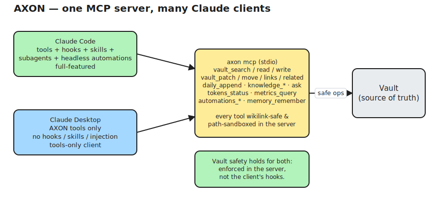

# AXON — A Local-First AI Operating System for Obsidian

[](LICENSE)
[](go.mod)
[](.github/workflows/ci.yml)
[](#install-macos-one-command)

> A single Go binary + an embedded React/Recharts dashboard. Pure-Go SQLite (no cgo). Reaches **Claude** through your **subscription or enterprise login — never an API key**.

AXON turns an Obsidian vault into a **second brain that maintains itself**. It's a local-first runtime that wires **Claude** and **Claude Code** into your vault: it triages your inbox, links and compacts notes, ingests external knowledge (articles, URLs, PDFs), accounts for every token it spends, and streams everything to a real-time local dashboard. Your vault stays plain Markdown; everything else is derived and disposable.

Clone it, set a handful of values, and stand it up with one command — twice over, in fact: a `personal` profile and a `work` profile, on different machines, under different Claude accounts and policies.

> 📖 **New here? Start with the [Setup & Usage Guide](docs/GUIDE.md)** — a complete walkthrough from a clean machine to a running system.

## Features

- **Self-maintaining vault** — scheduled automations triage your inbox, write daily logs, suggest links, compact notes, distil memory, and re-index. They run on *new material* (content-hash gated), not on a clock for its own sake.
- **Knowledge ingestion** — turn a URL, article, or PDF into a clean, linked Markdown note that's redacted, chunked, embedded (local **Ollama**), and indexed.
- **Hybrid search** — lexical (FTS5) + semantic (vector) over your whole vault, from the CLI or any Claude client.
- **Token-budgeted by design** — every Claude call is estimated, budgeted, and ledgered, with daily/weekly limits that protect your plan's rate limits.
- **MCP server** — wikilink-safe vault tools + hybrid search for both **Claude Code** and **Claude Desktop**.
- **Personal memory** — an identity layer (`USER` / `SOUL` / `MEMORY`) injected into every session so the assistant actually knows you.
- **Real-time dashboard** — a React/Recharts SPA embedded in the binary, streaming every run, token, ingest, and error over SSE.
- **Two isolated profiles** — run `personal` (Claude Max) and `work` (Enterprise SSO) with separate data, secrets, accounts, and policies. Nothing is shared.

## Safety guarantees (enforced in code, not by prompting)

1. **No Claude call bypasses the token manager.** Every path to Claude goes through one chokepoint: pre-flight estimate → budget check → run → ledger. The only Claude adapter is `claude -p` on your subscription/enterprise login.
2. **No vault mutation that isn't wikilink-safe.** Renames rewrite inbound links (`vault.move`); content edits land in `axon:*` managed blocks (`vault.patch`) and never clobber your prose; new notes via `vault.write`. There is **no** `vault.delete`, and the vault FS is sandboxed against path traversal.

## Install (macOS, one command)

```bash
git clone https://github.com/jandro-es/axon.git && cd axon
make setup           # build, install /usr/local/bin/axon, scaffold ~/.axon,
                     # start Ollama + the AXON daemon at login (idempotent)
```

`make setup` (a wrapper over [`scripts/install-macos.sh`](scripts/install-macos.sh)) checks prerequisites, builds the binary + dashboard, installs everything, and — on the first run — opens `~/.axon/config.yaml` so you can set your `vault_path`. Re-run it any time after editing the config; it converges instead of clobbering. Undo everything with `make uninstall-macos` (add `ARGS="--purge"` to also delete `~/.axon`). Flags: `--no-service`, `--no-ollama`, `--prefix DIR`, `--profile NAME`.

## Build & run (manual / Linux)

```bash
git clone https://github.com/jandro-es/axon.git && cd axon
mkdir -p ~/.axon                                  # the AXON home dir ($AXON_HOME)
cp axon.config.example.yaml ~/.axon/config.yaml   # set vault_path, profile, budgets (≤ 6 values)
cp .env.example ~/.axon/.env                       # CLAUDE_CODE_OAUTH_TOKEN from `claude setup-token`

(cd web && npm install && npm run build)       # build the dashboard SPA (Node, build-time only)
go build -o axon ./cmd/axon                     # single self-contained binary (SPA embedded)

./axon config validate                          # check the config
./axon init   --env ~/.axon/.env                # scaffold vault + DB + .claude wiring + dashboards
./axon doctor                                   # prerequisites health check
./axon start  --env ~/.axon/.env                # scheduler + dashboard at http://127.0.0.1:7777
```

The config is read from `~/.axon/config.yaml` by default (`$AXON_HOME/config.yaml`), independent of the working directory; pass `--config <path>` to override. On Linux, `axon service install` emits a systemd `--user` unit for auto-start. `go build` works without the SPA build (a fallback page is served until `web/dist` exists).

**Prerequisites:** the `claude` CLI (logged in for your `auth_mode`) and **Ollama** for local embeddings.

## Commands

| Command | What it does |
|---------|--------------|
| `axon init` | Provision the profile: data dir, DB, embedding check, vault scaffold, `.claude/` wiring (CLAUDE.md, `.mcp.json`, hooks, plugin), dashboards, first index. Idempotent. |
| `axon doctor` | Prerequisite checks: config, stray `ANTHROPIC_API_KEY`, `claude`/`ollama`, vault writable, port free, residency. |
| `axon config validate \| get \| set` | Validate, read, or comment-preservingly edit `config.yaml`. |
| `axon reindex [--embeddings]` | Rebuild the notes mirror + link graph from the vault; `--embeddings` re-embeds. |
| `axon ingest <url\|path> [--dry-run]` | Policy-gated fetch → clean → redact → summarise → write → chunk → embed → index. |
| `axon search <query> [--top-k]` | Hybrid lexical (FTS5) + semantic (vector) search. |
| `axon onboard` | Interactive wizard that builds your personal identity layer (no model call). |
| `axon status [--json]` | Remaining day/week token budget + guard state. |
| `axon run <automation> [--dry-run]` | Run one automation through the engine (same path as the scheduler). |
| `axon start [--no-dashboard]` | The daemon: scheduler + live SSE dashboard. |
| `axon mcp [install]` | The AXON MCP server (stdio); `install --client code\|desktop` wires a Claude client. |
| `axon service <install\|uninstall\|print>` | Emit/install an OS service unit (launchd / systemd / Task Scheduler). |
| `axon export [--out dir]` | Portable snapshot bundle (manifest + Markdown + activity). |
| `axon profiles [--json]` | Show each profile's isolated paths/policy (no secrets). |

**Automations:** `budget-guard`, `heartbeat`, `knowledge-reindex`, `context-export`, `link-suggester` (no Claude); `daily-log`, `inbox-triage`, `compaction`, `knowledge-digest`, `memory-distill` (via the token manager). Each is independently toggleable — an install with **all automations off** still runs and is useful.

## Architecture

The vault (plain Markdown) is durable memory; the **axon daemon** is the runtime around it; **Claude** (via Claude Code) is the brain and **Ollama** does local embeddings. The daemon owns one local **SQLite** database per profile (relational + FTS5 lexical + vector search), a knowledge-ingestion pipeline, a portable scheduler, the token chokepoint, an MCP server of wikilink-safe tools, and the embedded dashboard. SQLite is derived and disposable — `axon reindex` rebuilds it entirely from Markdown.


**Knowledge ingestion** — fetch → clean → redact → (idempotency gate) → summarise → write a linked note → chunk → embed → index:


**The token chokepoint** — every automation gates on new material; every Claude call is estimated, budgeted, and ledgered through exactly one path:


*Diagrams are editable — open the `.excalidraw` files in [docs/diagrams](docs/diagrams) at [excalidraw.com](https://excalidraw.com).*

## Personal memory & identity

AXON keeps a first-class **identity layer** in the vault so the assistant knows you in every session.


- **`02-Areas/Profile/`** holds `USER.md` (who you are), `SOUL.md` (the assistant's persona/boundaries) and `MEMORY.md` (durable decisions/lessons in an `axon:memory` managed block).
- **`axon onboard`** interviews you and writes the layer wikilink-safely, never clobbering edits (no model call).
- The **`SessionStart`** hook injects a token-bounded, redacted snapshot of USER + SOUL + recent MEMORY into each Claude Code session — no model call, disablable per profile.
- **`memory_remember`** (MCP tool) appends durable entries during interactive work; **`memory-distill`** (scheduled) distils recent daily notes into memory.

The personal layer never reaches logs, events, the token ledger, or exports — `memory_remember` makes no model call, `memory-distill` ledgers only token counts (never the text), and `axon export` writes counts, not bodies.

## Use it from Claude Desktop too

One MCP server, many clients.



```bash
axon mcp install --client desktop           # merge a profile-scoped entry into claude_desktop_config.json
axon mcp install --client desktop --print   # preview the JSON instead of writing
axon mcp install --client code              # (re)generate the project .claude/ wiring
```

The merge is **non-destructive** (other MCP servers are preserved) and profile-scoped. **Claude Desktop gets AXON's tools only** — no hooks, skills, subagents, or headless automations (those are Claude Code). Because every AXON tool is wikilink-safe and path-sandboxed *in the server*, vault safety holds regardless of client. `axon doctor` reports each client's registration. To register a community **Obsidian MCP** server alongside AXON's own, set `profiles.<p>.interop.obsidian_mcp`.

## Principles

- **Local-first.** All state lives on your disk: the vault (Markdown), one SQLite file per profile, Ollama for embeddings. The only network dependencies are Claude (via your login) and the URLs you choose to ingest.
- **The vault is the source of truth.** Databases are derived and disposable; they can always be rebuilt from Markdown.
- **Token frugality is a feature.** Every Claude call is measured, budgeted, and justified; automations run on new material, not on a clock.
- **Deterministic where it matters.** Budgets, redaction, egress allowlists, wikilink integrity, and destructive-op protection are enforced by code and hooks, never by asking the model nicely.
- **Observable.** Nothing happens silently — every run, token, ingest, and error is logged and visible on the dashboard.

## Documentation

| Document | Purpose |
|----------|---------|
| [**Setup & Usage Guide**](docs/GUIDE.md) | **Start here.** End-to-end: install, configure, run, and use every feature. |
| [Architecture](docs/02-architecture.md) | System design, module boundaries, data flow, ADRs. |
| [Data model & config](docs/04-data-model-and-config.md) | Vault layout, DB schema, frontmatter, full config reference. |
| [Knowledge ingestion](docs/05-component-knowledge-ingestion.md) | URL/article/PDF → Markdown → chunk → embed → index. |
| [Automation engine](docs/06-component-automation-engine.md) | Scheduler, the standard automations, headless agent runs. |
| [Context & token manager](docs/07-component-context-token-manager.md) | Counting, budgets, compaction, retrieval, frugality. |
| [Agent bridge & MCP](docs/08-component-agent-bridge-mcp.md) | MCP tools, hooks, skills, subagents, wikilink safety. |
| [Dashboard & observability](docs/09-component-dashboard-observability.md) | Real-time graphs, metrics, the knowledge graph. |
| [Personal memory & onboarding](docs/12-component-personal-memory-and-onboarding.md) | The identity layer, the `axon onboard` wizard, memory tools. |
| [Multi-client (Claude Desktop)](docs/13-component-multi-client-claude-desktop.md) | `axon mcp install --client desktop` + per-client `doctor`. |

Deeper design notes (product vision, numbered requirements, and the research behind the design) live in [docs/](docs/); build conventions are in [`CLAUDE.md`](CLAUDE.md).

## Contributing

Contributions are welcome — see [CONTRIBUTING.md](CONTRIBUTING.md) for build/test instructions, coding conventions, and the two cardinal rules every change must respect. Found a security issue? Please report it privately per [SECURITY.md](SECURITY.md).

## License

AXON is released under the [MIT License](LICENSE) — © 2026 jandro-es. You're free to use, modify, and distribute it; the software is provided "as is", without warranty.

> AXON is an independent, local-first tool. "Claude" and "Claude Code" are products of Anthropic; "Obsidian" and "Ollama" are their respective owners' products. AXON integrates with them but is not affiliated with or endorsed by them.
