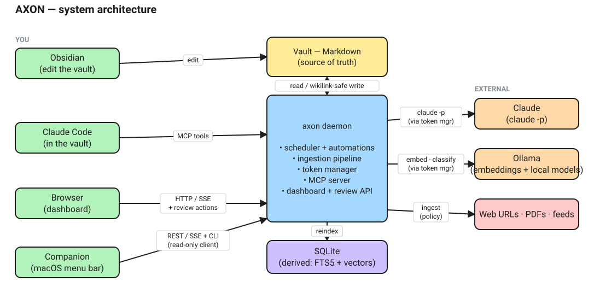
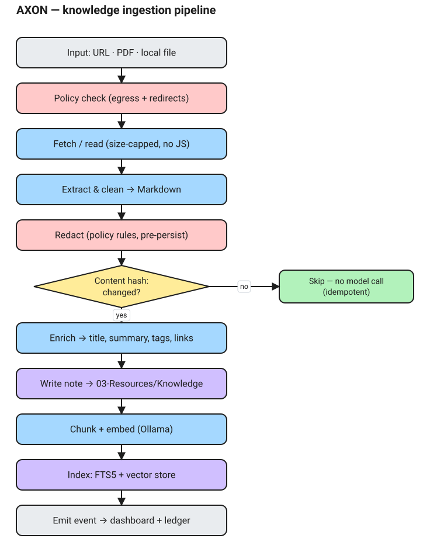
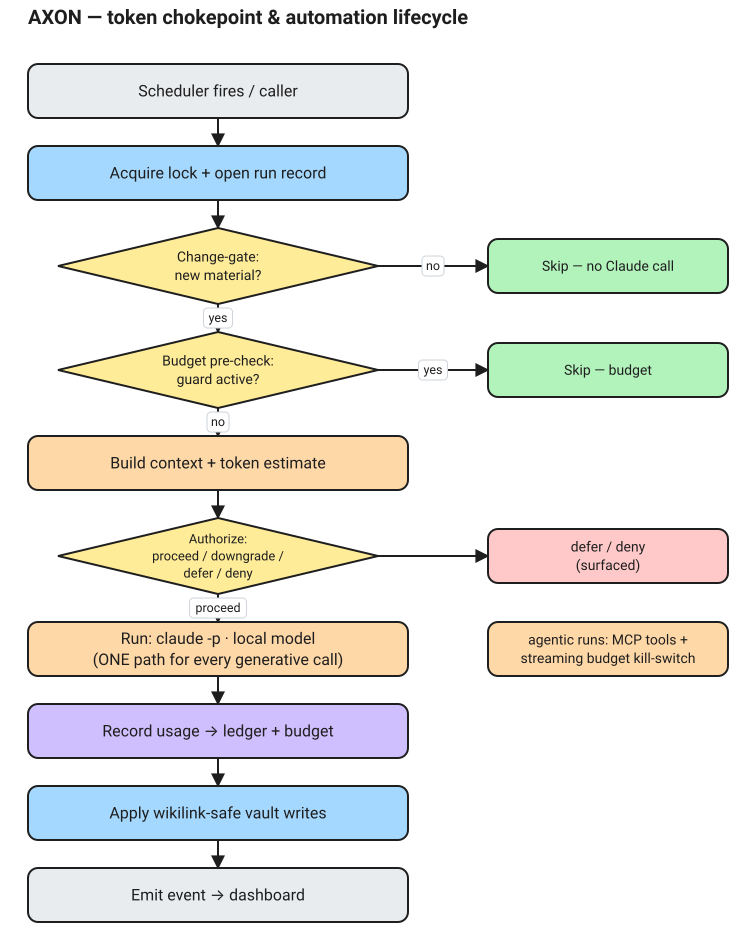

# AXON — A Local-First AI Operating System for Obsidian

[](LICENSE)
[](go.mod)
[](.github/workflows/ci.yml)
[](#install)

**AXON turns an Obsidian vault into a second brain that maintains itself.** It
is a single Go binary that runs beside your vault: it captures and ingests
knowledge, keeps the vault organised, remembers what you decide, tracks what
you have to do, and accounts for every token it spends — with **Claude**
(through your subscription or enterprise login, not an API key) as the brain,
and local models for the cheap work. Your vault stays plain Markdown;
everything else is derived and disposable.

> 📖 **New here?** [INSTALL.md](INSTALL.md) gets you from a clean machine to a
> running system in about 15 minutes, step by step — no terminal experience
> assumed. The [Setup & Usage Guide](docs/GUIDE.md) is the complete manual.

## What it does

**Knowledge flows in from everywhere.**
- Drop a URL, article, PDF, image/screenshot, or a YouTube/podcast link:
  `axon ingest` turns it into a clean, linked, redacted Markdown note — chunked,
  embedded (local Ollama or Apple on-device), and indexed. Images are read
  locally (OCR + on-device vision); media becomes a transcript note from its
  captions.
- Paste a URL into an inbox note or drop a file into `00-Inbox/` — the
  **capture** automation ingests it for you. The inbox is a funnel.
- Subscribe to RSS/Atom feeds (`axon subscribe`) and standing sources flow
  through the same pipeline, capped and deduplicated.
- **Hybrid search** (FTS5 lexical + vector semantic) over all of it, from the
  CLI or any Claude client.
- **Ask your vault**: `axon ask` answers questions from your notes only —
  grounded or silent, with `[[wikilink]]` citations enforced in code, and a
  conflict flag when your sources disagree.
- **Related notes**: `axon related <note>` (also a `vault_related` MCP tool and a
  dashboard panel) surfaces the notes most similar to one you're looking at —
  pure vector math, zero model calls.
- **Deep research** (opt-in): tag a question `#deep` with seed URLs and the
  `deep-research` automation fetches them through the egress-policied pipeline
  and writes one cited report — bounded by fetch and token budgets.

**The vault maintains itself.** Twenty-four scheduled automations — inbox
triage, daily log, note compaction, link suggestions, a morning **briefing**, a
weekly **resurfacer** that reconnects dormant notes to what you're working on
now, a weekly knowledge digest, memory distillation, **entity pages**, a weekly
**project pulse**, standing **research questions**, near-duplicate **merge
proposals**, and more. They run on *new material* (content-hash gated), never
on a clock for its own sake, and everything they propose lands in a review
queue you resolve with one click on the dashboard's **Review** tab. Turn any of
them off; a system with all automations off still runs and is useful. Each is
documented — including what it deliberately does *not* do — in
[docs/AUTOMATIONS.md](docs/AUTOMATIONS.md).

**It tracks what you have to do.** Every `- [ ]` checkbox in the vault is
indexed into one trusted GTD list — `axon actions` on the CLI, a consolidated
`01-Projects/Actions.md` note, and the dashboard's **Actions** tab, where
completing a task performs the one surgical, hash-addressed checkbox edit AXON
is allowed to make in your prose.

**It knows you, and remembers — in time.** An identity layer (`USER` / `SOUL` /
`MEMORY`) is injected into every Claude Code session, and AXON captures what
your sessions *decide*: finished sessions are distilled into durable decisions,
lessons, and preferences. Memory is **temporal** — facts carry validity
intervals, a superseded fact is struck through with its successor, never
deleted — and it happens privately (paths only, redacted before any model sees
text, never in logs or exports).

**Every token is measured.** One chokepoint authorizes, budgets, and ledgers
every generative call — Claude via `claude -p` on your login by default, an
optional direct-API mode, or **local models** (Ollama / Apple on-device) for
the cheap tiers, which cost nothing against your budget. Agentic runs (the
digest reads the week's sources; compaction checks backlinks and writes its
own summary through wikilink-safe tools) are bounded by turn caps and a
streaming kill-switch.

**Everything is visible.** A real-time dashboard (React SPA embedded in the
binary, SSE) streams every run, token, ingest, and error — light, dark, and
system appearance, a `⌘K` command palette, an interactive knowledge-graph map
with a hubs-and-orphans panel, a **Needs you** summary of everything waiting on
a human, per-automation reliability, the token ledger, and the Review tab.
Every chart exports as CSV/JSON. On a Mac, the optional **Axon Companion**
menu-bar app (`companion-v0.1.0`) puts daemon state, budgets, and controls one
click away — same daemon, same material language.

## Safety guarantees (enforced in code, not by prompting)

1. **No generative call bypasses the token manager.** Claude, local models,
   and the optional API mode all pass one chokepoint: estimate → budget check
   → run → ledger.
2. **No vault mutation that isn't wikilink-safe.** Renames rewrite inbound
   links (`vault_move`); edits land in `axon:*` managed blocks
   (`vault_patch`) and never clobber your prose. There is **no** delete, and
   the vault FS is sandboxed against path traversal. This holds for you, for
   automations, and for any agent — the safety lives in the server.

## Install

**[INSTALL.md](INSTALL.md) is the step-by-step path** — written so that
someone who has never opened a terminal can follow it, with an expected result
shown after every step. The short version for developers:

```bash
# Prerequisites: the claude CLI (logged in) and Ollama (embeddings)
curl -fsSL https://raw.githubusercontent.com/jandro-es/axon/main/install.sh | bash
axon doctor      # prerequisites, with the exact fix for anything missing
axon start       # scheduler + dashboard → http://127.0.0.1:7777
```

On a Mac, add the optional **[Companion](docs/18-component-companion.md)**
menu-bar app from the [latest release](https://github.com/jandro-es/axon/releases/latest)
(signed and notarised — it opens normally). Daily commands are documented in
[docs/COMMANDS.md](docs/COMMANDS.md); the short list is `ask`, `ingest`,
`search`, `actions`, `subscribe`, `run`, `status`, `configure`.

## Architecture

The vault (plain Markdown) is durable memory; the **axon daemon** is the
runtime around it; **Claude** is the brain and **Ollama** does embeddings and
the cheap local tiers. The daemon owns one SQLite file per profile
(relational + FTS5 + vectors — derived and fully rebuildable with
`axon reindex`), the ingestion pipeline, the scheduler, the token chokepoint,
an MCP server of wikilink-safe tools (used by Claude Code *and* Claude
Desktop), and the embedded dashboard.



**Ingestion** — every source (URL, PDF, file, inbox capture, feeds) takes the
same path: fetch → clean → redact → idempotency gate → enrich → linked note →
chunk → embed → index:



**The token chokepoint** — every automation gates on new material; every
generative call is estimated, budgeted, and ledgered through exactly one path:



*All diagrams are editable — open the `.excalidraw` sources in
[docs/diagrams](docs/diagrams) at [excalidraw.com](https://excalidraw.com).
The [Guide](docs/GUIDE.md) has two more: the personal-memory layer and the
multi-client wiring.*

## Two profiles, zero sharing

Run a `personal` profile (Claude Max) and a `work` profile (Enterprise SSO) as
separate installs — separate data, secrets, accounts, budgets, and egress
policies. The work profile is deny-by-default on ingestion and can disable
memory injection entirely. `axon profiles` shows the isolation surface, and
[docs/PROFILES.md](docs/PROFILES.md) documents every difference and where each
is enforced.

## Principles

- **Local-first.** All state on your disk; the only network dependencies are
  Claude (via your login) and the URLs you choose to ingest.
- **The vault is the source of truth.** Databases are derived and disposable.
- **Token frugality is a feature.** Measured, budgeted, justified; local
  models for the cheap work.
- **Deterministic where it matters.** Budgets, redaction, egress allowlists,
  and wikilink integrity are enforced by code and hooks, never by asking the
  model nicely.
- **Observable.** Nothing happens silently.

## Documentation

| Document | Purpose |
|----------|---------|
| [**Setup & Usage Guide**](docs/GUIDE.md) | **Start here.** End-to-end: install, configure, run, and use every feature. |
| [Installation](INSTALL.md) | Step-by-step install for everyone; developer fast path; update/uninstall; Windows. |
| [Command reference](docs/COMMANDS.md) | Every CLI command: what it does, what it doesn't, key flags, examples. |
| [Automations reference](docs/AUTOMATIONS.md) | All 24 automations: purpose, schedule, cost tier, and explicit non-goals. |
| [Profiles](docs/PROFILES.md) | Personal vs work: auth, budgets, egress, redaction, memory — and where each difference is enforced. |
| [Architecture](docs/02-architecture.md) | System design, module boundaries, data flow, ADR-001…037. |
| [Requirements](docs/03-requirements.md) | The numbered contract: FR-01…190, NFR-01…14. |
| [Data model & config](docs/04-data-model-and-config.md) | Vault layout, DB schema, frontmatter, full config reference. |
| [Knowledge ingestion](docs/05-component-knowledge-ingestion.md) | URL/PDF/capture/feeds → Markdown → chunk → embed → index. |
| [Automation engine](docs/06-component-automation-engine.md) | Scheduler, the standard automation set, agentic runs. |
| [Context & token manager](docs/07-component-context-token-manager.md) | Counting, budgets, local routing, compaction, frugality. |
| [Agent bridge & MCP](docs/08-component-agent-bridge-mcp.md) | MCP tools, hooks, agentic allowlists, wikilink safety. |
| [Dashboard & observability](docs/09-component-dashboard-observability.md) | Live charts, the Review tab, the knowledge graph. |
| [Personal memory & onboarding](docs/12-component-personal-memory-and-onboarding.md) | The identity layer, session memory, `axon onboard`. |
| [Multi-client (Claude Desktop)](docs/13-component-multi-client-claude-desktop.md) | One MCP server, many Claude clients. |
| [Companion (macOS)](docs/18-component-companion.md) | The menu-bar app: contract, build, QA state. |
| [1.1 roadmap](docs/14-roadmap-1.1.md) | Shipped in 1.1: ask-your-vault, ANN + reranker retrieval, memory/entity/pulse intelligence, capture + OCR reach. |
| [1.2 roadmap](docs/15-roadmap-1.2.md) | Shipped in 1.2 ("remember & reason, cheaply"): temporal memory, contradiction-aware ask, eval-gated local tier + verification cascade, related-notes surface, resurfacing scheduling, near-duplicate merge proposals. |
| [1.2.5 roadmap](docs/16-roadmap-1.2.5.md) | Shipped in 1.2.5 ("act on it"): GTD actions — one trusted list, the dashboard Actions tab, the hash-addressed complete mutation. |
| [1.3 roadmap](docs/17-roadmap-1.3.md) | Shipped in 1.3 ("perceive & research"): multimodal ingestion (images via OCR + local vision; YouTube/podcast captions) and bounded, budgeted, cited deep-research. |
| [Second-brain roadmap](docs/19-roadmap-second-brain.md) | Forward: candidate directions for AXON as a second brain. |
| [AI-OS roadmap](docs/20-roadmap-ai-os.md) | Forward: candidate directions for AXON as an AI operating system. |
| [macOS 27 plan](docs/21-roadmap-macos27.md) | Making the most of Apple's on-device models, the `fm` CLI, and OS-level MCP. |
| [Known issues](docs/ISSUES.md) | The triaged, living list of what needs fixing. |

Deeper design notes (vision, research, installer internals) live in
[docs/](docs/); build conventions are in [`CLAUDE.md`](CLAUDE.md).

## Contributing

Contributions are welcome — see [CONTRIBUTING.md](CONTRIBUTING.md) for
build/test instructions and the two cardinal rules every change must respect.
Security issues: report privately per [SECURITY.md](SECURITY.md).

## License

AXON is released under the [MIT License](LICENSE) — © 2026 jandro-es.

> AXON is an independent, local-first tool. "Claude" and "Claude Code" are
> products of Anthropic; "Obsidian" and "Ollama" belong to their respective
> owners. AXON integrates with them but is not affiliated with or endorsed by
> them.
