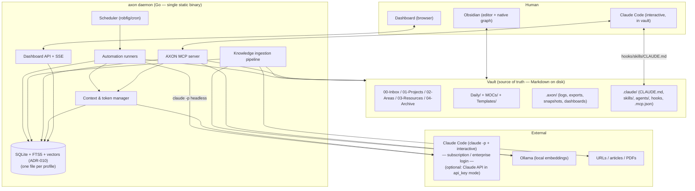

# 02 — Architecture

## 1. System at a glance



The **vault** is durable memory. The **daemon** is the runtime around it. **Claude Code** is the brain, reached two ways: interactively (via the MCP server + the installed plugin + hooks + `CLAUDE.md`) and on a schedule (headless `claude -p`). Both authenticate with your Claude **subscription** (personal: Max) or **enterprise** login (work) — there is no API key in the default modes (see ADR-009). The **dashboard** observes everything. The only required external services are **Claude Code** (which talks to Claude) and **Ollama**.

## 2. Module boundaries (single Go module)

One Go module (`module github.com/<you>/axon`), one binary, clear package seams. The backend, CLI, MCP server and automations are all Go; the **only** JavaScript is the dashboard SPA under `web/` (Vite + React + Recharts), whose built assets are embedded into the binary via `embed.FS` so distribution stays a single self-contained file.

```
axon/
  cmd/
    axon/        # main package — wires the CLI (init, start, stop, status, doctor, ingest, search, reindex, run,
                 #  export, config get/set/validate, mcp [install], hook, service, onboard, profiles, automations,
                 #  health, version) and composes the daemon (start_cmd.go: scheduler + dashboard + pidfile)
  internal/      # all application packages (private — not importable outside the module)
    config/      # types, schema (struct tags + validator), paths, profile resolution, secrets, content hashing
    core/        # cross-cutting operations: init (provisioning), doctor, reindex, reembed
    mcp/         # AXON MCP server (stdio): vault + knowledge + token tools
    dashboard/   # dashboard HTTP + SSE server (Go) that serves the SPA and streams events
    ...          # (db, vault, ingestion, embeddings, agent, tokens, scheduler, automations, events,
                 #  hooks, identity, clients, claudeassets, scaffold, search, service, health, ui — see below)
  web/           # dashboard SPA — Vite + React + Recharts; built to web/dist and embedded via embed.FS
  scripts/       # preflight + install/update/uninstall for macOS (launchd) & Linux (systemd), + _common.sh: build, install, service/Ollama wiring
  axon.config.example.yaml
  .env.example
```

Daemon orchestration (signal handling, pidfile, scheduler + dashboard + event
persistence wiring) lives in `cmd/axon/start_cmd.go` — `cmd` composes, packages
provide. The Claude Code plugin assets (CLAUDE.md template, skills, agents,
hooks wiring) and the vault scaffolding are embedded Go assets under
`internal/claudeassets/assets/` and `internal/scaffold/assets/`, written into
the vault by `axon init`.

**Dependency rule:** `internal/config` ← everyone. `internal/db`, `vault`, `embeddings`, `agent`, `events` are leaf packages; `tokens` is the only importer of `agent` (the chokepoint); `core` and `automations` compose the leaves; `mcp` composes its tools from the service layer (vault, db, search, tokens, ingestion, automations, identity); `dashboard` reads the db read-layer, event bus and token status. Nothing imports `cmd`. Keep the graph acyclic — Go enforces this at compile time, so a cycle is a design smell to fix, not silence.

### Core internal layout (`internal/`)

```
config/        # load + validate + resolve profile, secrets, policy types
db/            # modernc.org/sqlite: migrations, repositories (tokens, runs, sources, chunks, events, links), FTS5 + vector search
vault/         # markdown read/write, frontmatter, managed blocks, wikilink-safe ops
ingestion/     # fetch (egress-policied), extract, redact, chunk, enrich, persist (see Component 05)
embeddings/    # provider interface + Ollama impl + Apple on-device impl (ADR-013)
agent/         # Claude Code adapter (subprocess: `claude -p`); direct-API adapter (anthropic-sdk-go) for auth_mode: api_key
tokens/        # the chokepoint: estimates, budgets, ledger, redaction (see Component 07)
scheduler/     # robfig/cron/v3 wrapper: jitter, panic-safety, catch-up policy
automations/   # the engine + the standard automation set (see Component 06)
events/        # in-process event bus -> SSE + events table; structured logger (log/slog)
hooks/         # Claude Code hook logic (invoked via `axon hook <event>`)
identity/      # personal memory layer: USER/SOUL/MEMORY + onboarding (Component 12)
clients/       # Claude Desktop config merge (Component 13)
claudeassets/  # embedded .claude/ wiring assets (CLAUDE.md template, skills, agents, hooks)
scaffold/      # embedded vault scaffolding (folder READMEs, templates, Dataview dashboards)
search/        # hybrid search facade over db + embeddings
service/       # launchd/systemd unit generation for `axon service`
health/        # vault health scoring for `axon health`
ui/            # terminal styling for CLI output
```

## 3. Key data flows

### 3.1 Knowledge ingestion (Component 05)
`URL/PDF → fetch → extract main content → clean to Markdown → LLM enrich (title/summary/tags/links) under token budget → write note to 03-Resources/Knowledge → chunk → embed (Ollama) → upsert vectors (float32 BLOBs) + FTS5 → emit event`. Idempotent on content hash; re-ingest updates in place.

### 3.2 Scheduled automation (Component 06)
`Scheduler fires → runner acquires per-automation lock → change-gate (content hashes) → if no new material, log skip & exit → else build minimal context via retrieval → pre-flight token estimate vs budget → choose model → run (`claude -p`, or the direct-API adapter in `api_key` mode) → apply wikilink-safe vault writes (dry-run aware) → record run + tokens → emit event`.

### 3.3 Interactive session (Component 08)
`Claude Code starts in vault → SessionStart hook injects compact vault status (budget, inbox count, recent changes) → user works → MCP tools serve search/read/write/ingest/token-status → PostToolUse hook logs tokens of any AXON tool round-trips & flags budget → PreToolUse hook blocks unsafe file ops (enforces wikilink-safe path) → Stop hook suggests compaction if context large`.

### 3.4 Token accounting (Component 07)
Every path that calls Claude goes through the `agent` adapter, which (a) takes a pre-flight token estimate (exact `count_tokens` only in `api_key` mode), (b) consults the budget, (c) records reported `usage` post-hoc to the `token_ledger`, (d) emits an event the dashboard streams live.

## 4. Process & runtime model

- A single **long-running daemon** per profile (`axon start`) hosts the scheduler, ingestion workers, token manager, dashboard API/SSE and (optionally) the MCP server over a local socket. The MCP server is *also* runnable standalone via stdio for Claude Code to spawn (`axon mcp`) — Claude Code launches it per the generated `.mcp.json`.
- Concurrency: a small worker pool for embeddings (respect Ollama cold start + batch size 32); per-automation advisory locks so two runs never collide; ingestion queued.
- Persistence of daemon state is in SQLite; restart-safe. Missed schedules follow a configurable **catch-up policy** (`skip` | `run-once`).
- Crash safety: all vault writes are atomic (write temp + rename) and, for multi-file edits, staged then committed; a failed automation never leaves a half-edited note.

## 5. Security & policy model

- **Secrets** in `.env` or OS keychain, never in `config.yaml`, never committed, never logged, never sent to the model.
- **Egress allowlist** per profile: ingestion may only fetch from allowed domains (work profile defaults restrictive). The Claude API and Ollama hosts are always allowed.
- **Redaction** rules (regex/denylist) scrub matched content (secrets, client names) before anything leaves the machine for the Claude API.
- **Destructive-op protection:** delete/move/overwrite go through wikilink-safe ops with dry-run + confirmation; hard delete is never automated.
- **Prompt-injection posture:** content fetched from the web or read from files is *data, not instructions*. Ingestion never executes instructions found in fetched content; the enrichment prompt treats fetched text as quoted material.

## 6. Profiles & reproducibility

A profile is the unit of isolation. Resolution order for any setting: CLI flag → env (`AXON_*`) → `profiles/<name>` overlay → base `config.yaml` → built-in default. Each profile has its own data dir (`$AXON_HOME/profiles/<name>/`: `db.sqlite`, `logs/`, `exports/`, `snapshots/`), its own secrets, its own `CLAUDE_CONFIG_DIR`/API key, its own policy block and automation set. Nothing is shared. See Components 04 and 10.

---

## Architecture Decision Records

### ADR-001 — What "local-first" means here
**Decision:** All *data and infrastructure* are local (vault, SQLite, embeddings via Ollama, scheduler, dashboard). The *LLM* is reached through Claude Code (subscription/enterprise login) — or, optionally, the Claude API (`auth_mode: api_key`) — and is not localised in v1. The `agent` and `embeddings` modules are interfaces, leaving a seam for a local model later.
**Why:** Localising the frontier model is out of scope and would gut capability; localising *data* delivers the privacy, cost and offline-resilience benefits that motivate "local-first" for a second brain. Stating this prevents scope confusion.

### ADR-002 — One SQLite file (relational + vector + lexical)
**Decision:** SQLite with `sqlite-vec` (vectors) and FTS5 (lexical) in a single file per profile. *(Library choice amended by ADR-010 below: implemented on `modernc.org/sqlite` with brute-force cosine over float32 BLOBs; the single-file, pure-Go intent stands.)*
**Why:** Single-process, cross-platform, zero extra infrastructure; metadata, vectors and full-text live together so hybrid retrieval and budget queries need no cross-store joins. In Go this is reached via `ncruces/go-sqlite3` + `asg017/sqlite-vec-go-bindings/ncruces` (pure-Go WASM, no cgo — best fit for the single-binary goal) or `mattn/go-sqlite3` + the cgo bindings (faster, needs a C toolchain); the `db` package hides which. Alternatives (LanceDB, libSQL, server stores) are documented but rejected for v1 simplicity. Revisit only if vector count or latency targets break (see Component 05 §scale).

### ADR-003 — Go for the daemon
**Decision:** Go 1.22+, a single Go module, compiled to one self-contained static binary. CLI via `spf13/cobra`; config via `goccy/go-yaml` (or `gopkg.in/yaml.v3`) + `go-playground/validator`; scheduling via `gocron` (or `robfig/cron/v3`); HTTP/SSE via the standard library (`net/http`, Go 1.22 method-aware routing); the dashboard is a Vite + React + Recharts SPA under `web/`, built and embedded with `embed.FS` (the only JS in the repo).
**Why:** A single static binary with no runtime to install is the cleanest possible "clone, set values, one command" story, and Go cross-compiles trivially to the different machines and OSes the multi-profile requirement implies. Go's concurrency model fits a long-running daemon that juggles a scheduler, ingestion workers, an HTTP/SSE server and an MCP server. Official, maintained Go SDKs now exist for both halves of the brain: the **Claude API** (`github.com/anthropics/anthropic-sdk-go`, with `Messages.New` and `CountTokens`) and **MCP** (`github.com/modelcontextprotocol/go-sdk`, stdio transport, generic `AddTool`). `sqlite-vec` runs from Go either pure-Go (`ncruces/go-sqlite3` over wazero WASM, no cgo) or via cgo (`mattn/go-sqlite3`); FTS5 is built in. The maintainer also simply prefers Go.
**Trade-offs (stated honestly):** (1) Rich browser charting is the one place JS leads, so the operational dashboard is a small **React + Recharts SPA** under `web/` — the only JavaScript in the repo. Its built assets are embedded via `embed.FS`, so the shipped binary is still self-contained; `web/` needs a Node toolchain only at build time. Everything else — daemon, CLI, MCP, automations — is Go. (2) Some Go libraries here (the `sqlite-vec` bindings especially) are younger and move faster than their TS equivalents — pin versions, and keep `embeddings`, `db` and `agent` behind interfaces so a binding swap is local. (3) TypeScript/Node is a viable alternative for the whole stack (first-class everything, but needs a runtime); choosing it back would be a follow-up ADR.

### ADR-004 — External scheduler invoking headless Claude, not hook-spawned agents
**Decision:** Automations are driven by AXON's own scheduler calling `claude -p` headless (or the in-process Claude adapter for small tasks). Claude Code hooks handle only *in-session* deterministic concerns.
**Why:** Claude Code hooks cannot reliably spawn background agents, and scheduling belongs to a supervised, observable, budget-aware component. This keeps automations measurable and restart-safe, and keeps token spend inside AXON's ledger.

### ADR-005 — AXON owns its MCP server; community Obsidian MCP is optional interop
**Decision:** Ship a purpose-built MCP server with wikilink-safe writes and hybrid search; treat community Obsidian MCP servers as an optional, swappable fallback.
**Why:** The core loop must not depend on a fast-moving third-party server, and AXON needs token-status and knowledge-base tools no generic server provides. Wikilink safety is non-negotiable and best owned.

### ADR-006 — Vault is the source of truth; databases are derived
**Decision:** Any knowledge in SQLite must be reconstructable from the Markdown vault. `axon reindex` rebuilds everything from the vault.
**Why:** Durability and portability — if Obsidian or AXON vanish, the notes still work in any text editor. Prevents lock-in and makes the vector index disposable.

### ADR-007 — Frugality gates before every model call
**Decision:** No code path calls Claude without passing through the token manager (pre-flight count, budget check, change-gate, model selection).
**Why:** "Token-aware, not wasting tokens" is a stated requirement; making the manager a mandatory chokepoint is the only way to guarantee it rather than hope for it.

### ADR-008 — Scheduling in-daemon, OS units optional *(implemented with robfig/cron/v3)*
**Decision:** Default scheduling runs inside the daemon for cross-platform parity; `axon` can *emit* launchd/systemd/Task-Scheduler units on request.
**Why:** One config behaves identically on macOS/Linux/Windows; users who want OS-level supervision can opt in without the core depending on a specific OS scheduler.

### ADR-009 — Auth via Claude subscription/enterprise; Claude Code is the execution path
**Decision:** AXON reaches Claude **through Claude Code**, not a direct API key. Each installation sets one `claude.auth_mode`:
- `subscription` (personal, Claude Max): interactive Claude Code uses `claude login`; headless automations use a `CLAUDE_CODE_OAUTH_TOKEN` from `claude setup-token`.
- `enterprise` (work, Claude Enterprise SSO, **no API available**): SSO login, governed by org policy; the same headless token *if* the org permits `setup-token`, else automations run only under an authenticated session.
- `api_key` (optional): direct Claude API via `anthropic-sdk-go`, for accounts that have Console API access.

The two installations are **separate** (different machines, accounts, restrictions); one installation runs one active profile. `ANTHROPIC_API_KEY` is left **unset** in subscription/enterprise modes (Claude Code prioritises it and would bill the API account); `axon doctor` flags a stray key.

**Why:** The maintainer's accounts are a personal Max subscription and a work Enterprise plan with no API access; both are first-class through Claude Code, and `claude -p` usage draws on the plan's Agent SDK credit rather than per-token billing. Routing AXON's own program through a subscription OAuth token outside Claude Code would breach the consumer Terms, so the direct-API path is reserved for genuine API-key accounts.

**Consequences (mainly Component 07):** without API access there is no `count_tokens` endpoint, so pre-flight counting becomes a **local estimate** (tokeniser approximation) used to keep context bounded and to guard against rate-limit / Agent-SDK-credit burn; the ledger tracks **tokens and limit/credit consumption** rather than dollars (dollar cost applies only to `api_key` mode). Model selection is a *preference* passed to `claude -p --model`; actual availability follows the plan tier. The mandatory chokepoint (ADR-007) is unchanged — every call still passes through the token manager.

### ADR-010 — Pure-Go SQLite via `modernc.org/sqlite`; vectors brute-forced behind a seam (amends ADR-002)
**Decision:** Use `modernc.org/sqlite` (a maintained, cgo-free transpilation of current SQLite, **FTS5 built in**) as the single SQLite driver. Store chunk embeddings as `float32` BLOBs in a `vec_chunks` table and run **brute-force cosine KNN in Go** for semantic search, behind the `db` repository seam. Lexical search uses native **FTS5/bm25**. The `EmbeddingProvider` + vector-repository interfaces are unchanged, so an ANN backend can be swapped in later with no caller change.
**Why:** ADR-002's named pure-Go path — `ncruces/go-sqlite3` + `asg017/sqlite-vec-go-bindings/ncruces` — does not hold up in practice: the sqlite-vec binding (latest v0.1.6) is pinned to the long-superseded `ncruces` v0.17 API (`sqlite3.Binary`) and fails to build against current `ncruces` v0.35, while current `ncruces` ships **neither FTS5 nor sqlite-vec** in its embedded WASM. The choice was: freeze the database foundation ~18 minor versions behind to keep the official sqlite-vec binding, adopt a cgo build (breaking the single-static-binary / no-toolchain goal), or take a maintained pure-Go SQLite and defer the ANN extension. `modernc.org/sqlite` preserves every goal ADR-002 actually cares about (one file, pure-Go, single static binary, FTS5) and **sqlite-vec was always a scale optimisation, not a correctness requirement** — docs/05 §7 already documents brute-force as fine to ~10^5–10^6 chunks and names the swap path. So we take the simpler, maintained foundation now and keep the seam.
**Trade-offs:** brute-force KNN is O(n·dim) per query — comfortably within NFR-09 at personal-vault scale, but not the path to millions of chunks; when a vault approaches that (or p95 search breaks the NFR-09 budget) revisit with a real ANN index (sqlite-vec on a compatible driver, or LanceDB) behind the same repository seam. Re-affirms ADR-002's single-file, pure-Go intent; supersedes only its specific library names.

### ADR-011 — Personal memory & identity live in the vault, injected via SessionStart *(Phase 8 — built)*
**Decision:** Model the user profile (`USER.md`), agent persona (`SOUL.md`) and durable personal memory (`MEMORY.md`) as plain Markdown notes in the vault (`02-Areas/Profile/`) — **not** a separate store. They are generated/seeded by the `axon onboard` wizard, edited by the human, maintained by the `memory_remember` MCP tool plus an optional `memory-distill` automation, and surfaced to the agent by injecting a **bounded** summary in the existing `SessionStart` hook (no model call).
**Why:** Consistent with ADR-006 (the vault is the source of truth) — identity is just more durable, portable, human-editable Markdown that shows up in Obsidian and rebuilds with the vault. `SessionStart` injection makes "the brain knows me" deterministic and free (no retrieval, no token spend), reusing a hook AXON already owns and that already injects status. A dedicated identity store would fragment the source of truth and add a sync surface for no benefit.
**Trade-offs:** injecting every session has a context cost, so the injection is a *compact, token-bounded* rendering (full files stay in the vault); large memories are kept in budget by the `memory-distill` automation (a compaction-style summarisation). This is the most personal data in the vault, so it is covered explicitly by redaction and NFR-14 and never leaves except as the bounded session context the user controls.

### ADR-012 — Multi-client via standard MCP; Claude Code is full-featured, Claude Desktop is tools-only *(Phase 9 — built)*
**Decision:** AXON's MCP server is the single integration point for any MCP client. **Claude Code** gets the full experience (MCP tools + hooks + plugin + generated `CLAUDE.md` + headless `claude -p` automations). **Claude Desktop** is supported as a **tools-only** client: `axon mcp install --client desktop` writes a profile-scoped `mcpServers` entry into `claude_desktop_config.json` (non-destructively); Desktop gets the vault/knowledge/token tools but not hooks, skills, subagents or headless runs.
**Why:** The MCP server already speaks the standard protocol and the registration JSON shape is identical across clients, so Desktop support is a thin wiring + documentation task, not a second server. Being explicit that Desktop lacks the deterministic hooks prevents a false sense of the `SessionStart`/`PreToolUse` guarantees there. Crucially, AXON's own tools are wikilink-safe and path-sandboxed *in the server*, so vault safety for AXON operations does not depend on the client's hooks.
**Trade-offs:** on Desktop the user loses the session-start profile injection (FR-72) and the `PreToolUse` guard over the *client's built-in* file tools; mitigations are to keep all vault mutation in AXON's tools and to document the gap (FR-75). Concurrent clients share one single-writer SQLite per profile, and the daemon remains the owner of scheduled writes (FR-76).

### ADR-013 — Apple on-device embeddings via a compiled-at-init Swift helper subprocess
**Decision:** Offer `embeddings.provider: apple` as a config-selectable alternative to Ollama, backed by Apple's on-device **NLContextualEmbedding** (NaturalLanguage framework, macOS 14+, dim 512). The API is Swift-only, so AXON ships the helper **as source embedded in the Go binary**, compiles it once during `axon init` with `swiftc` (Xcode CLT is the prerequisite; a SHA-256 marker makes re-runs skip the compile), installs it at `~/.axon/bin/axon-apple-embed` (machine-level, outside profile isolation), and shells out to it with JSON over stdin/stdout — the same subprocess seam as the `claude -p` adapter. The Go side is another `embeddings.Provider` implementation; no caller changes.
**Why:** macOS users get server-less, fully local embeddings with zero model management (assets are fetched on-device by the framework), and the Go binary stays pure Go. Rejected: **cgo** linking of NaturalLanguage (breaks the single-static-binary goal of ADR-010 and cross-compilation), and **committed prebuilt binaries** (drift, signing/Gatekeeper questions, binaries in git). Compile-at-init from embedded source keeps `axon init` reproducible from a bare installed binary (FR-01) and the helper trivially rebuildable when the source changes.
**Trade-offs:** darwin-only (config validation accepts `apple` everywhere, but init/doctor/the provider surface a clear macOS-only warning elsewhere, and the Linux installer refuses it); requires Xcode CLT once; the model is fixed (no alternative sizes/dims like Ollama offers) and its dim (512) differs from the Ollama defaults, so switching provider in either direction requires `axon reindex --embeddings`. Ollama remains the default and the cross-platform path.

### ADR-014 — Charm TUI stack (bubbletea + huh + lipgloss) for the entire CLI surface
**Decision:** Adopt the Charm family as the one terminal-UI dependency set: `bubbletea` runs live interactive views, `huh` provides forms/menus (onboard, configure, setup), `lipgloss` styles all output. Every command renders a live view on a TTY; the pre-existing plain renderers remain the canonical output for non-TTY, `--json`, and CI — enforced by a single `tui.Interactive` gate so headless paths can never block on a prompt (NFR-05 posture).
**Why:** The ops surface (install, update, configure, provider switching, vault migration) needs real interactivity; hand-rolled ANSI + bufio prompts don't scale to menus/progress and were already duplicated across onboard and the installers. Charm is the de-facto standard, pure Go, and replaces bespoke code rather than adding to it (`internal/ui` shrinks to a lipgloss facade). User-directed adoption; recorded because it crosses the "no heavyweight framework without an ADR" guardrail.
**Trade-offs:** three new dependencies and a second rendering path per command (live vs plain). Mitigations: plain renderers stay canonical and tested; live views are thin adapters over the same structured results; all Charm usage funnels through `internal/tui` so a future swap is one package.

### ADR-015 — Local model routing through the token-manager chokepoint (Ollama + Apple Foundation Models) *(built)*
**Decision:** Allow the cheap model tiers to be routed to a **local** provider via provider-prefixed model strings in the existing config fields: `models.classify: ollama:<model>` (Ollama `/api/chat`), `models.classify: apple` (Apple Foundation Models on-device `SystemLanguageModel`, macOS 26+/Apple Silicon/Apple Intelligence, classify tier only), anything else remains a Claude model string. Both new adapters implement the existing `agent.Agent` interface and are dispatched by a small router **inside the token-manager chokepoint** — `tokens` remains the only importer of `agent`, and cardinal rule 1 generalizes to *no generative call, Claude or local, bypasses the token manager*. Local calls are **ledgered but budget-exempt** (windows keep meaning "Claude quota"; no defer/deny/downgrade, no budget-guard pressure), and a `models.local_fallback: claude | fail` toggle (default `claude`) governs what happens when a local model fails or produces schema-invalid output: one local retry, then fall forward to Claude through the normal budget path, or fail visibly. The Apple adapter reuses ADR-013's delivery verbatim (Swift source embedded via `go:embed`, compiled at init with `swiftc`, SHA-256 marker, JSON over stdin/stdout, `--check-availability` probe) and uses guided generation when the call supplies an output schema. `synthesis` always stays on Claude. Scope is the **on-device model only** — the framework's Private Cloud Compute and third-party backends are excluded.
**Why:** ADR-001 deliberately left this seam ("the LLM stays remote *for now*"), and the economics changed: classify-tier work (triage labels, enrichment metadata) neither needs a frontier model nor should spend subscription quota. Ollama is already a system dependency (embeddings) and the Swift-helper pattern is already proven (ADR-013), so both adapters are marginal additions rather than new infrastructure. Routing through the chokepoint preserves the observability invariant (every call ledgered and streamed) and the dependency rule unchanged. Prefixed strings were chosen over a structured `{provider, model}` block because they are backward compatible with every existing config and the TUI. This amends ADR-007 (chokepoint now fronts multiple providers) and ADR-009 (a per-tier provider axis orthogonal to the global `auth_mode`), and supersedes the apple-embeddings spec's note that FoundationModels generation was out of scope — it is in scope precisely because it runs *inside* the chokepoint.
**Trade-offs:** small local models have a real quality floor — mitigated by output-schema validation (guided generation on Apple; JSON mode + validate on Ollama) and the fall-forward default; users choosing `local_fallback: fail` trade reliability for strict frugality. The Apple path adds an OS/hardware/Apple-Intelligence gate (doctor-surfaced) and a small shared context window, so it is confined to `classify` with a pre-flight input cap. Budget exemption means the token windows no longer describe *total* model traffic — the ledger and dashboard remain the complete record. (Spec: `docs/superpowers/specs/2026-07-03-local-model-routing-design.md`; FR-77…FR-80.)
