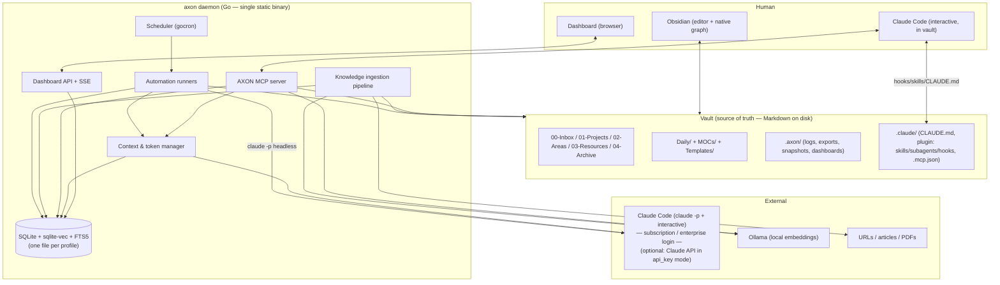

# 02 — Architecture

## 1. System at a glance



The **vault** is durable memory. The **daemon** is the runtime around it. **Claude Code** is the brain, reached two ways: interactively (via the MCP server + the installed plugin + hooks + `CLAUDE.md`) and on a schedule (headless `claude -p`). Both authenticate with your Claude **subscription** (personal: Max) or **enterprise** login (work) — there is no API key in the default modes (see ADR-009). The **dashboard** observes everything. The only required external services are **Claude Code** (which talks to Claude) and **Ollama**.

## 2. Module boundaries (single Go module)

One Go module (`module github.com/<you>/axon`), one binary, clear package seams. The backend, CLI, MCP server and automations are all Go; the **only** JavaScript is the dashboard SPA under `web/` (Vite + React + Recharts), whose built assets are embedded into the binary via `embed.FS` so distribution stays a single self-contained file.

```
axon/
  cmd/
    axon/        # main package — wires the CLI (init, start, stop, status, doctor, ingest, reindex, run, export)
  internal/      # all application packages (private — not importable outside the module)
    config/      # types, schema (struct tags + validator), logging, paths, profile resolution, content hashing
    core/        # daemon orchestration: scheduler, automation runners, ingestion, token manager, db layer
    mcp/         # AXON MCP server (stdio): vault + knowledge + token tools
    dashboard/   # dashboard HTTP + SSE handlers (Go) that serve the SPA and stream events
    ...          # (db, vault, ingestion, embeddings, agent, tokens, scheduler, automations, api, events — see below)
  web/           # dashboard SPA — Vite + React + Recharts; built to web/dist and embedded via embed.FS
  plugin/        # Claude Code plugin: skills/, agents/, hooks/, .mcp.json template, CLAUDE.md template
  scripts/       # install.sh / install.ps1, prereq checks
  templates/     # vault scaffolding (folder READMEs, note templates, Dataview dashboards)
  axon.config.example.yaml
  .env.example
```

**Dependency rule:** `internal/config` ← everyone. `internal/db`, `vault`, `embeddings`, `agent`, `tokens` are leaf-ish packages; `core` composes them; `mcp` may import the db read-layer + vault + tokens; `dashboard` imports only the read-layer + event bus. Nothing imports `cmd`. Keep the graph acyclic — Go enforces this at compile time, so a cycle is a design smell to fix, not silence.

### Core internal layout (`internal/`)

```
config/        # load + validate + resolve profile, policy enforcement helpers
db/            # connection, migrations, repositories (tokens, runs, sources, chunks, events, links)
vault/         # markdown read/write, frontmatter, wikilink-safe ops, link graph index
ingestion/     # fetch, extract, clean, chunk, embed, persist (see Component 05)
embeddings/    # provider interface + Ollama impl
agent/         # Claude Code adapter (subprocess: `claude -p` headless + interactive); optional direct-API adapter (anthropic-sdk-go) for auth_mode: api_key
tokens/        # accounting, budgets, frugality gates (see Component 07)
scheduler/     # gocron wrapper, jitter, locks, catch-up policy
automations/   # one package per automation (see Component 06)
api/           # net/http server (dashboard handlers + SSE bus) + MCP wiring
events/        # in-process event bus -> SSE + db; structured logger (log/slog)
```

## 3. Key data flows

### 3.1 Knowledge ingestion (Component 05)
`URL/PDF → fetch → extract main content → clean to Markdown → LLM enrich (title/summary/tags/links) under token budget → write note to 03-Resources/Knowledge → chunk → embed (Ollama) → upsert into sqlite-vec + FTS5 → emit event`. Idempotent on content hash; re-ingest updates in place.

### 3.2 Scheduled automation (Component 06)
`Scheduler fires → runner acquires per-automation lock → change-gate (content hashes) → if no new material, log skip & exit → else build minimal context via retrieval → pre-flight token estimate vs budget → choose model → run (`claude -p`, or the direct-API adapter in `api_key` mode) → apply wikilink-safe vault writes (dry-run aware) → record run + tokens → emit event`.

### 3.3 Interactive session (Component 08)
`Claude Code starts in vault → SessionStart hook injects compact vault status (budget, inbox count, recent changes) → user works → MCP tools serve search/read/write/ingest/token-status → PostToolUse hook logs tokens of any AXON tool round-trips & flags budget → PreToolUse hook blocks unsafe file ops (enforces wikilink-safe path) → Stop hook suggests compaction if context large`.

### 3.4 Token accounting (Component 07)
Every path that calls Claude goes through the `agent` adapter, which (a) takes a pre-flight token estimate (exact `count_tokens` only in `api_key` mode), (b) consults the budget, (c) records reported `usage` post-hoc to the `token_ledger`, (d) emits an event the dashboard streams live.

## 4. Process & runtime model

- A single **long-running daemon** per profile (`axon start`) hosts the scheduler, ingestion workers, token manager, dashboard API/SSE and (optionally) the MCP server over a local socket. The MCP server is *also* runnable standalone via stdio for Claude Code to spawn (`axon mcp`) — Claude Code launches it per the generated `.mcp.json`.
- Concurrency: a small worker pool for embeddings (respect Ollama cold start + batch size 32); per-automation advisory locks so two runs never collide; ingestion queued.
- Persistence of daemon state is in SQLite; restart-safe. Missed schedules follow a configurable **catch-up policy** (`skip` | `run-once`).
- Crash safety: all vault writes are atomic (write temp + rename) and, for multi-file edits, staged then committed; a failed automation never leaves a half-edited note.

## 5. Security & policy model

- **Secrets** in `.env` or OS keychain, never in `axon.config.yaml`, never committed, never logged, never sent to the model.
- **Egress allowlist** per profile: ingestion may only fetch from allowed domains (work profile defaults restrictive). The Claude API and Ollama hosts are always allowed.
- **Redaction** rules (regex/denylist) scrub matched content (secrets, client names) before anything leaves the machine for the Claude API.
- **Destructive-op protection:** delete/move/overwrite go through wikilink-safe ops with dry-run + confirmation; hard delete is never automated.
- **Prompt-injection posture:** content fetched from the web or read from files is *data, not instructions*. Ingestion never executes instructions found in fetched content; the enrichment prompt treats fetched text as quoted material.

## 6. Profiles & reproducibility

A profile is the unit of isolation. Resolution order for any setting: CLI flag → env (`AXON_*`) → `profiles/<name>` overlay → base `axon.config.yaml` → built-in default. Each profile has its own data dir (`$AXON_HOME/profiles/<name>/`: `db.sqlite`, `logs/`, `exports/`, `snapshots/`), its own secrets, its own `CLAUDE_CONFIG_DIR`/API key, its own policy block and automation set. Nothing is shared. See Components 04 and 10.

---

## Architecture Decision Records

### ADR-001 — What "local-first" means here
**Decision:** All *data and infrastructure* are local (vault, SQLite, embeddings via Ollama, scheduler, dashboard). The *LLM* is reached through Claude Code (subscription/enterprise login) — or, optionally, the Claude API (`auth_mode: api_key`) — and is not localised in v1. The `agent` and `embeddings` modules are interfaces, leaving a seam for a local model later.
**Why:** Localising the frontier model is out of scope and would gut capability; localising *data* delivers the privacy, cost and offline-resilience benefits that motivate "local-first" for a second brain. Stating this prevents scope confusion.

### ADR-002 — One SQLite file (relational + vector + lexical)
**Decision:** SQLite with `sqlite-vec` (vectors) and FTS5 (lexical) in a single file per profile.
**Why:** Single-process, cross-platform, zero extra infrastructure; metadata, vectors and full-text live together so hybrid retrieval and budget queries need no cross-store joins. In Go this is reached via `ncruces/go-sqlite3` + `asg017/sqlite-vec-go-bindings/ncruces` (pure-Go WASM, no cgo — best fit for the single-binary goal) or `mattn/go-sqlite3` + the cgo bindings (faster, needs a C toolchain); the `db` package hides which. Alternatives (LanceDB, libSQL, server stores) are documented but rejected for v1 simplicity. Revisit only if vector count or latency targets break (see Component 05 §scale).

### ADR-003 — Go for the daemon
**Decision:** Go 1.22+, a single Go module, compiled to one self-contained static binary. CLI via `spf13/cobra`; config via `goccy/go-yaml` (or `gopkg.in/yaml.v3`) + `go-playground/validator`; scheduling via `gocron` (or `robfig/cron/v3`); HTTP/SSE via the standard library (`net/http`, Go 1.22 method-aware routing); the dashboard is a Vite + React + Recharts SPA under `web/`, built and embedded with `embed.FS` (the only JS in the repo).
**Why:** A single static binary with no runtime to install is the cleanest possible "clone, set values, one command" story, and Go cross-compiles trivially to the different machines and OSes the multi-profile requirement implies. Go's concurrency model fits a long-running daemon that juggles a scheduler, ingestion workers, an HTTP/SSE server and an MCP server. Official, maintained Go SDKs now exist for both halves of the brain: the **Claude API** (`github.com/anthropics/anthropic-sdk-go`, with `Messages.New` and `CountTokens`) and **MCP** (`github.com/modelcontextprotocol/go-sdk`, stdio transport, generic `AddTool`). `sqlite-vec` runs from Go either pure-Go (`ncruces/go-sqlite3` over wazero WASM, no cgo) or via cgo (`mattn/go-sqlite3`); FTS5 is built in. The maintainer also simply prefers Go.
**Trade-offs (stated honestly):** (1) Rich browser charting is the one place JS leads, so the operational dashboard is a small **React + Recharts SPA** under `web/` — the only JavaScript in the repo. Its built assets are embedded via `embed.FS`, so the shipped binary is still self-contained; `web/` needs a Node toolchain only at build time. Everything else — daemon, CLI, MCP, automations — is Go. (2) Some Go libraries here (the `sqlite-vec` bindings especially) are younger and move faster than their TS equivalents — pin versions, and keep `embeddings`, `db` and `agent` behind interfaces so a binding swap is local. (3) TypeScript/Node is a viable alternative for the whole stack (first-class everything, but needs a runtime); choosing it back would be a follow-up ADR.

### ADR-004 — External scheduler invoking headless Claude, not hook-spawned agents
**Decision:** Automations are driven by AXON's own scheduler calling `claude -p` headless (or the in-process Claude adapter for small tasks). Claude Code hooks handle only *in-session* deterministic concerns.
**Why:** Claude Code hooks cannot reliably spawn background agents, and scheduling belongs to a supervised, observable, budget-aware component. This keeps automations measurable and restart-safe, and keeps token spend inside AXON's ledger.

### ADR-005 — AXON owns its MCP server; community Obsidian MCP is optional interop
**Decision:** Ship a purpose-built MCP server with wikilink-safe writes and hybrid search; treat community Obsidian MCP servers as an optional, swappable fallback.
**Why:** The core loop must not depend on a fast-moving third-party server, and AXON needs token-status and knowledge-base tools no generic server provides. Wikilink safety is non-negotiable and best owned.

### ADR-006 — Vault is the source of truth; databases are derived
**Decision:** Any knowledge in SQLite must be reconstructable from the Markdown vault. `axon reindex` rebuilds everything from the vault.
**Why:** Durability and portability — if Obsidian or AXON vanish, the notes still work in any text editor. Prevents lock-in and makes the vector index disposable.

### ADR-007 — Frugality gates before every model call
**Decision:** No code path calls Claude without passing through the token manager (pre-flight count, budget check, change-gate, model selection).
**Why:** "Token-aware, not wasting tokens" is a stated requirement; making the manager a mandatory chokepoint is the only way to guarantee it rather than hope for it.

### ADR-008 — Scheduling in-daemon (gocron), OS units optional
**Decision:** Default scheduling runs inside the daemon for cross-platform parity; `axon` can *emit* launchd/systemd/Task-Scheduler units on request.
**Why:** One config behaves identically on macOS/Linux/Windows; users who want OS-level supervision can opt in without the core depending on a specific OS scheduler.

### ADR-009 — Auth via Claude subscription/enterprise; Claude Code is the execution path
**Decision:** AXON reaches Claude **through Claude Code**, not a direct API key. Each installation sets one `claude.auth_mode`:
- `subscription` (personal, Claude Max): interactive Claude Code uses `claude login`; headless automations use a `CLAUDE_CODE_OAUTH_TOKEN` from `claude setup-token`.
- `enterprise` (work, Claude Enterprise SSO, **no API available**): SSO login, governed by org policy; the same headless token *if* the org permits `setup-token`, else automations run only under an authenticated session.
- `api_key` (optional): direct Claude API via `anthropic-sdk-go`, for accounts that have Console API access.

The two installations are **separate** (different machines, accounts, restrictions); one installation runs one active profile. `ANTHROPIC_API_KEY` is left **unset** in subscription/enterprise modes (Claude Code prioritises it and would bill the API account); `axon doctor` flags a stray key.

**Why:** The maintainer's accounts are a personal Max subscription and a work Enterprise plan with no API access; both are first-class through Claude Code, and `claude -p` usage draws on the plan's Agent SDK credit rather than per-token billing. Routing AXON's own program through a subscription OAuth token outside Claude Code would breach the consumer Terms, so the direct-API path is reserved for genuine API-key accounts.

**Consequences (mainly Component 07):** without API access there is no `count_tokens` endpoint, so pre-flight counting becomes a **local estimate** (tokeniser approximation) used to keep context bounded and to guard against rate-limit / Agent-SDK-credit burn; the ledger tracks **tokens and limit/credit consumption** rather than dollars (dollar cost applies only to `api_key` mode). Model selection is a *preference* passed to `claude -p --model`; actual availability follows the plan tier. The mandatory chokepoint (ADR-007) is unchanged — every call still passes through the token manager.

### ADR-010 — Pure-Go SQLite via `modernc.org/sqlite`; vectors brute-forced behind a seam (amends ADR-002)
**Decision:** Use `modernc.org/sqlite` (a maintained, cgo-free transpilation of current SQLite, **FTS5 built in**) as the single SQLite driver. Store chunk embeddings as `float32` BLOBs in a `vec_chunks` table and run **brute-force cosine KNN in Go** for semantic search, behind the `db` repository seam. Lexical search uses native **FTS5/bm25**. The `EmbeddingProvider` + vector-repository interfaces are unchanged, so an ANN backend can be swapped in later with no caller change.
**Why:** ADR-002's named pure-Go path — `ncruces/go-sqlite3` + `asg017/sqlite-vec-go-bindings/ncruces` — does not hold up in practice: the sqlite-vec binding (latest v0.1.6) is pinned to the long-superseded `ncruces` v0.17 API (`sqlite3.Binary`) and fails to build against current `ncruces` v0.35, while current `ncruces` ships **neither FTS5 nor sqlite-vec** in its embedded WASM. The choice was: freeze the database foundation ~18 minor versions behind to keep the official sqlite-vec binding, adopt a cgo build (breaking the single-static-binary / no-toolchain goal), or take a maintained pure-Go SQLite and defer the ANN extension. `modernc.org/sqlite` preserves every goal ADR-002 actually cares about (one file, pure-Go, single static binary, FTS5) and **sqlite-vec was always a scale optimisation, not a correctness requirement** — docs/05 §7 already documents brute-force as fine to ~10^5–10^6 chunks and names the swap path. So we take the simpler, maintained foundation now and keep the seam.
**Trade-offs:** brute-force KNN is O(n·dim) per query — comfortably within NFR-09 at personal-vault scale, but not the path to millions of chunks; when a vault approaches that (or p95 search breaks the NFR-09 budget) revisit with a real ANN index (sqlite-vec on a compatible driver, or LanceDB) behind the same repository seam. Re-affirms ADR-002's single-file, pure-Go intent; supersedes only its specific library names.
