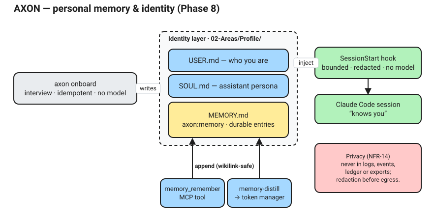
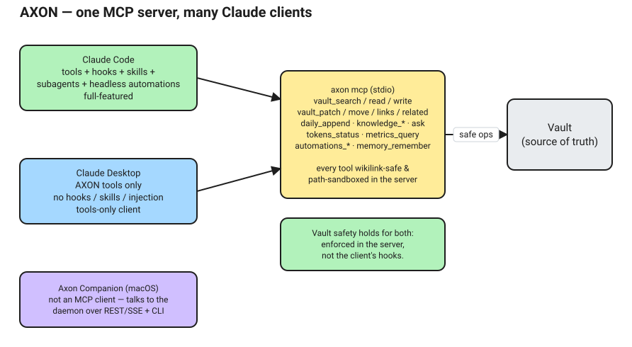

# AXON — Installation, Setup & Usage Guide

AXON turns an Obsidian vault into a self-maintaining second brain: a single local
Go daemon beside your vault that ingests knowledge, runs token-aware automations,
exposes wikilink-safe tools to Claude Code, and shows everything on a live local
dashboard. This guide takes you from a clean machine to a running, useful system.

- [1. How it works (60-second overview)](#1-how-it-works-60-second-overview)
- [2. Prerequisites](#2-prerequisites)
- [3. Installation](#3-installation)
- [4. Configuration](#4-configuration)
- [5. First run & setup](#5-first-run--setup)
- [6. Everyday usage](#6-everyday-usage)
- [7. Knowledge ingestion & search](#7-knowledge-ingestion--search)
- [8. Automations & the daemon](#8-automations--the-daemon)
- [9. Token budgeting](#9-token-budgeting)
- [10. The dashboard](#10-the-dashboard)
- [11. Claude Code integration](#11-claude-code-integration)
- [12. Profiles (personal vs work)](#12-profiles-personal-vs-work)
- [13. Running as a background service](#13-running-as-a-background-service)
- [14. Backup & export](#14-backup--export)
- [15. Command reference](#15-command-reference)
- [16. Troubleshooting](#16-troubleshooting)
- [17. Safety guarantees](#17-safety-guarantees)
- [18. Personal memory & identity](#18-personal-memory--identity)
- [19. Use AXON from Claude Desktop](#19-use-axon-from-claude-desktop)
- [20. The macOS menu bar app (Companion)](#20-the-macos-menu-bar-app-companion)

---

## 1. How it works (60-second overview)


- **The vault is the source of truth.** Everything lives as plain Markdown on
  disk. AXON's SQLite database is *derived* and disposable — `axon reindex`
  rebuilds it from the vault at any time.
- **One binary.** The daemon, CLI, MCP server and the embedded dashboard are a
  single static Go binary. The only external services are **Claude** (reached
  through Claude Code on your subscription, not an API key) and **Ollama** (local
  embeddings).
- **Two cardinal rules** are enforced in code, not by convention:
  1. Every call to Claude goes through the token manager (estimate → budget →
     run → ledger). Nothing spends tokens off the books.
  2. Every vault write is wikilink-safe: renames rewrite inbound links, edits go
     into `axon:*` managed blocks, and there is **no delete**.
- **Profiles** isolate everything. A `personal` install (Claude Max) and a `work`
  install (Claude Enterprise) are separate, on separate machines, sharing no
  data, secrets or account.

---

## 2. Prerequisites

| Requirement | Why | Notes |
|-------------|-----|-------|
| **Go 1.26+** | build the binary | only if building from source (a dependency requires it) |
| **Node 18+ / npm** | build the dashboard SPA | build-time only; the binary embeds the result |
| **Claude Code CLI** (`claude`) | the "brain" | install from claude.com/code; log in with your plan |
| **Ollama** | local embeddings for search | install from ollama.com; pull an embedding model. **Not an option on your machine?** On Apple silicon Macs, AXON can use **Apple's on-device Foundation Models** instead — no server, no downloads (§4, "Providers"). |
| **Obsidian** (optional) | edit the vault | AXON operates on Markdown directly; Obsidian need not run |

Check what you have:

```bash
go version          # go1.26+
node --version      # v18+
claude --version    # Claude Code CLI
ollama --version    # Ollama
```

Pull the embedding model named in your config (default `nomic-embed-text`, 768-dim):

```bash
ollama pull nomic-embed-text
```

> Embeddings power *semantic* search. AXON degrades gracefully without Ollama —
> notes are still written and **lexically** searchable (FTS5); vectors are marked
> pending and back-filled by `axon reindex --embeddings` once Ollama is up.

---

## 3. Installation

### Quick install (macOS / Linux) — no toolchain needed

One line downloads the latest release binary (SHA-256 verified) and hands over
to the interactive `axon setup`, which asks for your vault path, profile and
embeddings provider (Apple on-device vs Ollama), then provisions everything:

```bash
curl -fsSL https://raw.githubusercontent.com/jandro-es/axon/main/install.sh | bash
```

(`--user` installs to `~/.local/bin` without sudo; `--no-setup` installs the
binary only.) `axon setup` is idempotent — re-run it any time; existing config
and secrets are always kept. **Update later with `axon update`** (checksum-
verified self-update from GitHub Releases; `axon doctor` and the dashboard tell
you when one is available) and **remove with `axon uninstall`** (`--purge`
also deletes `~/.axon`; your vault is never touched).

### Building from source

First check your toolchain, then let one command build, install, and wire up
auto-start:

```bash
git clone https://github.com/jandro-es/axon.git && cd axon
make doctor         # check build + runtime deps (prints how to install any that are missing)
make setup          # dispatches to the macOS (launchd) or Linux (systemd --user) installer
```

`make setup` is idempotent and verbose, and does the following:

1. **Runs the dependency preflight** — Go (required), Node (optional, for the dashboard SPA), the `claude` CLI, and Ollama; anything missing is reported with the exact install command for your package manager. On macOS it offers to install Ollama via Homebrew.
2. **Builds** the dashboard SPA + the `axon` binary and installs it to `/usr/local/bin/axon` (override with `--prefix DIR`; uses `sudo` only if the target isn't writable).
3. **Scaffolds** `~/.axon/config.yaml` and `~/.axon/.env` (chmod 600) from the shipped examples. On the **first** run it offers to open the config so you can set your `vault_path`; re-run `make setup` after editing.
4. **Prepares Ollama** — starts it at login (macOS `brew services`) and pulls your embedding model.
5. **Runs `axon init`** to provision the profile (data dir, DB, vault scaffold, `.claude` wiring, first index).
6. **Installs an auto-start service** — a launchd agent on macOS (`~/Library/LaunchAgents/com.axon.<profile>.plist`) or a `systemd --user` unit on Linux — so the daemon starts at login and restarts on crash, then verifies the dashboard answers.

Useful flags (via `ARGS`, e.g. `make setup ARGS="--no-ollama"`): `--no-service` (skip auto-start), `--no-ollama` (manage Ollama yourself), `--profile NAME`, `--prefix DIR`, `--skip-build`.

**Update** a from-source install after pulling new code (release installs just
run `axon update`):

```bash
make update          # rebuild, swap the binary (with the version delta), re-run
                     # axon init (DB migrations + wiring + dashboards), reload the daemon
```

It preserves your config, secrets, and SQLite DB, and lists any config settings the new version ships that you don't have yet (never applied silently).

**Uninstall** everything with:

```bash
axon uninstall                 # stop + remove the daemon, service and binary; keep ~/.axon
axon uninstall --purge         # also delete ~/.axon (typed confirmation) — your vault is never touched
```

(`make uninstall` remains for from-source installs.)

### Moving your vault

One command relocates the vault and updates every reference AXON owns —
`vault_path` in the config and the `.claude/` wiring inside the vault; the
search index needs nothing because it stores vault-relative paths:

```bash
axon vault move ~/Documents/NewVaultLocation
```

It refuses while the daemon runs (offers to stop it; `--stop-daemon` in
scripts), verifies cross-filesystem copies before deleting the source, and
reminds you of the one thing it cannot update: Obsidian's own vault bookmark —
use "Open folder as vault" once at the new location.

Run `make` with no arguments for the full, self-documenting target list, and see [INSTALL.md](../INSTALL.md) for the complete cross-platform guide (Windows included).

### Build from source

```bash
git clone https://github.com/jandro-es/axon.git
cd axon

# 1) Build the dashboard SPA (Node is needed only here, at build time)
cd web && npm install && npm run build && cd ..

# 2) Build the single binary (SPA is embedded via embed.FS)
go build -o axon ./cmd/axon

# 3) (optional) put it on your PATH
sudo mv axon /usr/local/bin/      # or: cp axon ~/bin/
```

`go build` works even **without** the SPA build — the binary then serves a minimal
fallback page until `web/dist` exists. Building the SPA gives you the full
charts/graph dashboard.

### Authenticate Claude Code (headless token)

The daemon runs Claude headlessly (`claude -p`) for automations, so it needs a
non-interactive credential:

```bash
claude login          # interactive login for your plan (Max / Enterprise SSO)
claude setup-token    # prints a ~1-year CLAUDE_CODE_OAUTH_TOKEN — copy it into .env
```

> **Never set `ANTHROPIC_API_KEY`** on a subscription/enterprise install — Claude
> Code would prioritise it and bill the API account instead of your plan. `axon
> doctor` warns if it finds one.

---

## 4. Configuration

All behaviour comes from two files: the **config** at `~/.axon/config.yaml` and
the **secrets** file `.env`.

### `config.yaml`

AXON reads `~/.axon/config.yaml` by default (more precisely `$AXON_HOME/config.yaml`,
so it follows an `AXON_HOME` override). It does **not** depend on your working
directory — you can run `axon` from anywhere. Pass `--config <path>` to point at
a different file.

Copy the annotated example out of the cloned repo into that location and edit a
handful of values:

```bash
mkdir -p ~/.axon                               # the AXON home dir
cp axon.config.example.yaml ~/.axon/config.yaml
```

> Prefer a different location? Put the file anywhere and pass `--config <path>`
> to every command (or set `AXON_HOME` to move the whole `~/.axon` tree).

The **≤ 6 values** you typically set per profile:

```yaml
profiles:
  personal:
    vault_path: "~/Notes/Personal"        # 1. your Obsidian vault
    data_dir:   "~/.axon/profiles/personal" # 2. where the DB/logs/exports live (outside the vault)
    claude:
      auth_mode: subscription              # 3. subscription | enterprise | api_key
      config_dir: "~/.axon/profiles/personal/claude"
      oauth_token: env:CLAUDE_CODE_OAUTH_TOKEN_PERSONAL  # 4. secret reference (resolved from .env)
    embeddings:
      model: nomic-embed-text              # 5. must match the Ollama model + its dim
      dim: 768
    limits:
      daily_tokens:  1_500_000             # 6. your token budget (guards plan rate-limit burn)
      weekly_tokens: 8_000_000
```

Everything else (dashboard port, retrieval depth, policy, automations) has sane
defaults in the example file. Validate before you run:

```bash
axon config validate
axon config get limits.daily_tokens          # read a value (profile-relative dotted key)
axon config set models.synthesis claude-opus-4-8   # update one (comment-preserving, re-validated)
```

`config set` edits only the target key, preserves the file's comments and
formatting, and refuses to write a change that would make the config invalid.

### `.env` (secrets only)

Secrets never live in the YAML — they're referenced by name (`env:NAME`, or
`keychain:NAME` for the OS keychain) and resolved at runtime (`env:` from `.env`
or the real environment), never logged or sent to the model.

`.env` is read from `~/.axon/.env` by default (next to the config, and found
regardless of the working directory); pass `--env <path>` to read it from
elsewhere — the service unit records whatever path was in effect at
`axon service install` time.

```bash
cp .env.example ~/.axon/.env
# then edit:
CLAUDE_CODE_OAUTH_TOKEN_PERSONAL=sk-ant-oat01-…   # from `claude setup-token`
```

### Providers: Ollama, Apple on-device, or Claude-only

Two subsystems can run on local models, and each has an Apple on-device
alternative for machines where Ollama is unavailable or not allowed
(corporate policy, no local servers, no model downloads):

| Subsystem | Config key | Ollama | Apple on-device | Neither available |
|-----------|-----------|--------|-----------------|-------------------|
| **Embeddings** (semantic search) | `embeddings.provider` | `ollama` + any embedding model | `apple` — macOS on Apple silicon; a tiny Swift helper compiled once at `axon init`; no server, nothing listening | search degrades to lexical-only (FTS5); vectors back-fill later |
| **Cheap model tiers** (classify / routine) | `models.classify`, `models.routine` | `"ollama:<chat model>"` on either tier | `"apple"` — **classify tier only**; macOS 26+ with Apple Intelligence enabled (`axon doctor` checks availability). On macOS 27+, `"apple:system"` serves classify through the `fm` CLI with measured token usage, and `"apple:pcc"` (requires `models.pcc_enabled: true`) adds a Private Cloud Compute rung that can also serve routine — opt-in, quota-advised, and it degrades to your fallback when PCC is unreachable | leave the tiers on Claude model strings (the default) |

Rules that hold in every setup: **synthesis is always Claude**, agentic runs
require Claude (local models cannot drive MCP tools), and every local call
still passes the token chokepoint — fully ledgered (`cost_usd` null) but
**budget-exempt**. `models.local_fallback` decides what happens when a local
call fails: `claude` (default) falls forward through the normal budget-checked
path; `fail` surfaces the error instead. `models.apple_helper` overrides the
compiled helper's path if you manage binaries centrally.

**Ready-made setups** (`axon configure` drives all of this interactively):

```yaml
# 1) Default — Ollama for embeddings, Claude for all model tiers
embeddings: { provider: ollama, model: nomic-embed-text, dim: 768 }
models:     { classify: claude-haiku-4-5, routine: claude-sonnet-5, synthesis: claude-opus-4-8 }

# 2) Frugal — Ollama also serves the cheap tiers (free, offline, budget-exempt)
models:
  classify: "ollama:qwen3:8b"
  routine:  "ollama:qwen3:8b"
  synthesis: claude-opus-4-8

# 3) Apple-only — no Ollama anywhere (Apple silicon; classify needs macOS 26+
#    with Apple Intelligence). Nothing is downloaded, no server runs.
embeddings: { provider: apple, model: apple-nlcontextual-v1, dim: 512 }
models:
  classify: "apple"
  routine:  claude-sonnet-5
  synthesis: claude-opus-4-8

# 4) Restricted box, no local models at all — lexical-only search, Claude tiers.
#    Simply don't install Ollama; AXON degrades gracefully and doctor says so.
```

Switching the embeddings provider re-embeds the index — run it as one flow:

```bash
axon configure embeddings apple --reindex     # switch + compile helper + re-embed
axon configure models classify apple          # classify tier on-device
axon doctor                                   # verifies Apple FM availability / Ollama reachability
```

### Resolution & precedence

For any setting: **CLI flag → `AXON_*` env → `profiles.<active>` → built-in
default.** Pick the active profile with `--profile <name>` or `AXON_PROFILE=…`.

---

## 5. First run & setup

```bash
axon doctor                      # check prerequisites (claude, ollama, ports, vault writable, stray API key)
axon init --env ~/.axon/.env     # provision everything — idempotent and verbose
```

> Config is read from `~/.axon/config.yaml` automatically. The `--env` flag is
> only needed if you keep secrets at `~/.axon/.env` (recommended) rather than a
> `.env` in the current directory.

`axon init` performs, printing ✓/↻/⚠/✗ for each step:

1. **Resolve & validate** config + the active profile.
2. **Prerequisite checks** (shared with `doctor`).
3. **Data dir** — create `~/.axon/profiles/<name>/{logs,exports,snapshots,claude}`.
4. **Database** — create `db.sqlite` and run migrations.
5. **Embedding model** — verify the model is available in Ollama.
6. **Vault scaffold** — create the PARA layout, folder READMEs and note templates
   **only where missing** (never clobbers your notes).
7. **Claude Code wiring** — write `.claude/CLAUDE.md`, `.mcp.json`, hooks
   (`settings.json`) and the plugin (skills + subagents).
8. **In-vault dashboards** — generate Dataview dashboard notes in `.axon/dashboards/`.
9. **First index** — build the notes mirror + link graph.
10. **Summary** — report what was created vs already present.

Re-running `axon init` is safe: it converges and reports "no changes".

### What the vault looks like after init

```
<vault>/
  00-Inbox/         01-Projects/   02-Areas/   03-Resources/{,Knowledge/}   04-Archive/
  Daily/  MOCs/  Templates/
  .axon/            logs, exports, snapshots, dashboards, review-queue.md
  .claude/          CLAUDE.md, .mcp.json, settings.json, agents/, skills/, plugins/axon/
```

---

## 6. Everyday usage

A typical loop:

1. **Capture** — drop a thought into `00-Inbox/` or today's daily note (in
   Obsidian, as normal). No AXON command needed. The `capture` automation goes
   further: a bare URL pasted into an inbox note is ingested automatically, and
   a non-Markdown file dropped into `00-Inbox/` is ingested and archived —
   the inbox is a funnel, not a graveyard.
2. **Ingest** external material:
   ```bash
   axon ingest https://example.com/some-article
   axon ingest ~/Downloads/paper.md
   ```
3. **Search** across everything (lexical + semantic):
   ```bash
   axon search "reciprocal rank fusion"
   axon search "vector databases" --top-k 5 --json
   ```
4. **Ask the vault in Claude Code** — open Claude Code inside the vault; it gets
   AXON's MCP tools and a session-start status block (see §11).
5. **Let automations run** — start the daemon and the scheduler maintains the
   vault on new material (see §8):
   ```bash
   axon start
   ```
6. **Check the budget** any time:
   ```bash
   axon status
   ```
7. **Review proposals** — automations queue suggestions (links, triage moves,
   resurfaced connections) in `.axon/review-queue.md`; accept or dismiss them
   with one click on the dashboard's **Review** tab (§10). Each morning the
   `briefing` automation writes an orientation block into the daily note, and
   the weekly `resurfacer` proposes connections between what you're working on
   now and dormant notes that relate to it.

### Capture from anywhere (browser + Shortcuts)

With the dashboard running (`dashboard.capture_enabled` is on by default), you
can drop a page or selection straight into your inbox. AXON writes it to
`00-Inbox/` and the `capture` automation ingests it on its next tick — no model
call happens at capture time.

**Bookmarklet.** Create a new bookmark with this as the URL (adjust the port if
you changed `dashboard.port`). Clicking it on any page opens a small AXON tab
that captures the URL, title, and any selected text, then closes itself:

```
javascript:(function(){var p=7777;window.open('http://127.0.0.1:'+p+'/capture#u='+encodeURIComponent(location.href)+'&t='+encodeURIComponent(document.title)+'&s='+encodeURIComponent((''+getSelection()).slice(0,2000)));})()
```

The bookmarklet opens AXON's own `/capture` page, which performs the actual
guarded request same-origin — an arbitrary web page cannot POST to the endpoint
itself (the guard requires a same-origin request carrying a custom header).

**macOS Shortcuts / curl.** For a share-sheet Shortcut, add a *Get Contents of
URL* action:

- URL: `http://127.0.0.1:7777/api/capture`
- Method: `POST`
- Headers: `Content-Type: application/json`, `X-Axon-Capture: 1`
- Request Body (JSON): `{ "url": <Shortcut Input> }`

The same request from a terminal:

```bash
curl -sS http://127.0.0.1:7777/api/capture \
  -H 'Content-Type: application/json' -H 'X-Axon-Capture: 1' \
  -d '{"url":"https://example.com/article","title":"Something to read"}'
```

Set `dashboard.capture_enabled: false` to turn the endpoint off entirely.

---

## 7. Knowledge ingestion & search

### Images and screenshots

`axon ingest photo.png` (CLI-only, never agent-reachable) turns an image into
a searchable note: text is recovered **OCR-first**, and when the OCR text is
sparse a local **vision** model describes the image instead. `ingestion.vision`
selects the provider: `off` (default), `ollama:<vision-model>` (e.g.
`ollama:qwen2.5vl`), `apple` (macOS 27 on-device via the `fm` CLI), or
`apple:pcc` (Private Cloud Compute — requires `models.pcc_enabled: true`, and
note that redaction rules apply to text, not pixels: PCC vision sends the
**unredacted image bytes** to Apple-operated compute, which is why it is a
deliberate, explicit mode and never a fallback). Vision is a budget-exempt
local perception call — it never touches your Claude budget — and a vision
failure defers to whatever text OCR recovered — when OCR found nothing, the
ingest reports the vision provider's actual error instead of writing an
empty note. The
original image is copied (never moved) into the vault's attachments folder.

### Ask your vault

`axon ask` answers a question **from your notes only** — grounded or silent:

```bash
axon ask "what did we decide about vector index sizing?"
axon ask "summarise what I know about RRF" --json
```

Retrieval builds a bounded context (`retrieval.top_k` / `max_context_tokens`);
when nothing relevant is retrieved AXON refuses **without spending a token**.
Otherwise one synthesis-tier call answers with `[[wikilink]]` citations, and a
code-enforced contract guarantees every citation resolves to a note the
retrieval actually returned — an unverifiable answer is reported as a refusal
(with the retrieved sources listed so you can read them yourself). `NOT_FOUND`
means your notes genuinely don't answer it. Over-budget asks follow the
standard downgrade ladder (a cheaper tier still answers); every run is
ledgered under operation `ask`.

`axon ingest <url|path>` runs the pipeline: **policy check → fetch/read →
extract main content → clean to Markdown → redact → hash (idempotency) →
summarise → write a linked note in `03-Resources/Knowledge/` → chunk → embed →
index**.


```bash
axon ingest https://example.com/article          # a URL
axon ingest ./notes/meeting.md                    # a local Markdown/text file (CLI only)
axon ingest ./papers/report.pdf                   # a local PDF (text extracted) (CLI only)
axon ingest https://example.com/article --dry-run # show the intended note + token estimate, write nothing
```

- **Idempotent:** re-ingesting unchanged content is a no-op ("skipped").
- **Redaction:** any text matching the profile's `redaction_rules` is scrubbed
  **before** it is persisted or could reach the model — including the title.
- **Suggested links** are written to `.axon/review-queue.md` for you to approve.
- **Egress is policed:** only `ingest_domains_allow` hosts are fetched (the work
  profile is deny-by-default); redirects are re-validated each hop.
- Ingestion of **local files** is allowed from the CLI (you typed it) but refused
  on the agent-driven MCP path, so a prompt-injected agent can't read your
  `~/.ssh` into the vault.
- **Transient failures retry** (429/5xx, network blips — twice with backoff);
  a 401/403 or a page that turns out to be a **login screen fails loudly** with
  a hint instead of writing a junk note.

### Sources behind SSO (Confluence, internal wikis)

The daemon cannot reuse your browser session — give it its own credential,
scoped to that domain only (it is never sent to any other host, including
redirect targets):

```yaml
ingestion:
  auth:
    - domain: acme.atlassian.net
      header: Authorization            # default
      value: "env:CONFLUENCE_AUTH"     # secret ref — never inline tokens in config.yaml
```

with `.env` holding e.g. `CONFLUENCE_AUTH="Basic <base64 of email:api-token>"`
(Confluence Cloud) or `CONFLUENCE_AUTH="Bearer <personal-access-token>"`
(Server/DC). For a one-off, `axon ingest <url> --header 'Authorization: Bearer …'`
applies the header to that URL's own domain only.

**Confluence page URLs get a further upgrade:** once authenticated, AXON
fetches the page through the Confluence REST API (clean storage HTML) instead
of the JavaScript app shell — which is why unauthenticated Confluence ingests
used to come back empty. Wiki-style pages that the article extractor rejects
also fall back to full-page conversion rather than yielding nothing.

### Feed subscriptions (RSS / Atom)

Standing sources feed the same pipeline. Subscribe from the CLI — the feed is
fetched and parsed to verify it, its host checked against the ingest policy,
and the config edited comment-preservingly:

```bash
axon subscribe https://example.com/feed.xml        # verify + add (refused if the host isn't allowed; --allow opts it in)
axon subscribe list                                # feeds + seen-state
axon subscribe remove https://example.com/feed.xml # drop feed + seen-state (re-subscribing re-baselines)
```

The `subscriptions` automation polls hourly: **subscribe-from-now** (no
backfill flood), at most `max_per_tick` items per feed per tick, each item
attempted once, and conditional GETs (`ETag`/`If-Modified-Since`) make an
unchanged feed a free `304` skip. New items become ordinary knowledge notes —
searched, resurfaced, and synthesized into the weekly digest.

Search fuses **FTS5/bm25** (lexical) with **brute-force cosine** over embeddings
(semantic), ranked by reciprocal-rank fusion:

```bash
axon search "how does hybrid retrieval work"
```

Rebuild derived state from the vault any time (the DB is disposable):

```bash
axon reindex               # notes mirror + link graph
axon reindex --embeddings  # also re-embed (after a model change / to back-fill pending vectors)
```

### Changing settings

`axon configure` is the simple way to change common settings — on a terminal it
opens an interactive menu; in scripts use the subcommands:

```bash
axon configure                                   # interactive menu
axon configure embeddings apple --reindex        # switch to Apple on-device embeddings, re-embed now
axon configure embeddings ollama --model nomic-embed-text --dim 768 --reindex
axon configure models synthesis claude-opus-4-8
axon configure limits daily 2000000
axon configure automations knowledge-digest off
```

Switching the embeddings provider runs the whole chain in one flow: persist
the config, converge (compile the Apple helper or verify the Ollama model),
and re-embed the index (confirmed interactively, `--reindex` in scripts).

---

## 8. Automations & the daemon

`axon start` runs the in-daemon scheduler (cron, with jitter and per-automation
locks) and serves the dashboard. Each automation **gates on new material** — with
nothing changed it logs a skip and makes **no Claude call**.

Run any automation manually (same code path as the scheduler):

```bash
axon run knowledge-reindex
axon run daily-log --dry-run   # print intended edits + token estimate, write nothing
```

The standard automations (each toggleable in config, gated by `allowed_automations`):

| Automation | Model? | What it does |
|------------|--------|--------------|
| `budget-guard` | no | Pauses non-essential automations near the budget cap; essential, never paused. |
| `heartbeat` | no* | Writes a compact status line (inbox, budget) into today's daily note. *Setting its `model:` adds an opt-in one-line synthesis when something is noteworthy. |
| `knowledge-reindex` | no | Rebuilds notes/links and re-embeds pending chunks when the vault changes. |
| `context-export` | no | Writes a portable snapshot bundle to `.axon/exports/`. |
| `link-suggester` | no | Vector-similarity sweep proposing Zettelkasten links to the review queue; remembers what it proposed, so a dismissed suggestion stays dismissed. |
| `capture` | no* | The inbox funnel: ingests URLs pasted into inbox notes and files dropped into `00-Inbox/` (archives the originals). *`capture.enrich: claude` is optional. |
| `resurfacer` | no* | Weekly vector sweep proposing connections between recently-touched and dormant notes, scheduled at lengthening (FSRS-flavoured) intervals so a declined item returns later, not next week. *An opt-in routine-tier contradiction check (set `budget_tokens > 0`) reclassifies genuinely contradictory pairs. |
| `subscriptions` | no* | Hourly RSS/Atom polling into the ingestion pipeline (§7). *`subscriptions.enrich: claude` is optional. |
| `briefing` | yes | Morning orientation block in the daily note: deterministic facts + one short narrative (degrades to facts-only under budget pressure). |
| `daily-log` | yes | Synthesises today's note into its `axon:summary` block. |
| `inbox-triage` | yes | Classifies inbox items into PARA, proposes structured moves/tags to the review queue. |
| `compaction` | yes | Distils oversized notes into durable summaries (agentic by default: checks backlinks, writes via `vault_patch`). |
| `knowledge-digest` | yes | Weekly digest of newly ingested sources (agentic by default: reads the week's sources for grounded wikilinks). |
| `memory-distill` | yes | Distils recent activity into durable entries in `MEMORY.md`'s managed block (§18). |
| `session-distill` | yes | Distils finished Claude Code sessions (recorded by the Stop/SessionEnd hooks) into MEMORY entries — decisions, lessons, preferences (§18). |
| `research-questions` | yes | Weekly: answers standing questions in `03-Resources/Research Questions.md` from your vault (grounded), into an `axon:answers` block. Off by default. |
| `entity-pages` | yes | Extracts named people/projects from new notes into auto-maintained `Entities/` index pages with wikilink-safe mention lists. Off by default. |
| `project-pulse` | yes | Weekly: reads `01-Projects/` + USER goals into an `axon:pulse` block (progress, stalls, next actions); nudges stale projects to the review queue. Off by default. |
| `eval-drift` | no† | Re-runs `axon eval` for a gated local tier when its Ollama model digest changes, keeping promotion evidence-based. Off by default. †Local (budget-exempt) eval calls only. |
| `merge-proposals` | no | Weekly near-duplicate sweep (mean-vector cosine ≥ 0.92): proposes note merges to the review queue. Accepting runs the wikilink-safe `vault.Merge` — the survivor keeps its prose and gains the loser's content, inbound links retarget, and the loser is archived to `.trash/merged/`, never deleted. Off by default. |
| `actions-consolidate` | no | Daily zero-model render of every open GTD task in the vault into `01-Projects/Actions.md` (overdue / today / this week / next / waiting / someday) as wikilinked references — never duplicate checkboxes. |
| `actions-review` | no | Weekly sweep for open, undated actions in notes untouched for `actions.stale_after_days` (30): proposes each to the review queue once; accepting tags it `#someday`. Off by default. |
| `action-extract` | yes | Extracts implicit commitments ("I'll send the deck Friday") from recent notes to the review queue; accepting writes a real checkbox into the source note's `axon:tasks` block, which the actions index parses. Off by default — the only token spender in the actions feature. |
| `deep-research` | yes | Weekly: a `#deep`-tagged question with seed URLs in `03-Resources/Research Questions.md` has its sources fetched through the normal ingestion pipeline (egress policy, redaction, dedup), then one closed-book synthesis call writes a cited report under `03-Resources/Research/`. Bounded by `research.max_fetches`/`research.budget_tokens`; denied hosts are never fetched. Off by default, personal-profile only. |

The complete per-automation reference — including what each automation
deliberately does *not* do — is `docs/AUTOMATIONS.md`.

**Agentic runs.** `knowledge-digest` and `compaction` run *agentically* by
default: Claude runs headlessly with a small allowlist of AXON's own MCP tools
(read tools plus, for compaction, the managed-block-safe `vault_patch`),
bounded turns, and a streaming kill-switch that terminates the run the moment
its `budget_tokens` is exceeded. The allowlist is enforced on both sides of
the wire — the subprocess MCP server physically lacks every unlisted tool.
`automations.<name>.agentic: false` restores the plain one-shot path, which is
also the automatic degradation on a budget kill. For a write-capable agentic
automation, `axon run <name> --dry-run` spawns the agent with **report-only**
write tools: every write validates and reports what it *would* change without
mutating (a real preview at real token cost).

Configure schedules and budgets per automation:

```yaml
automations:
  daily-log:    { enabled: true, schedule: "30 21 * * *", model: routine, budget_tokens: 120_000 }
  inbox-triage: { enabled: true, schedule: "*/30 * * * *", model: classify, budget_tokens: 80_000 }
```

**Dry-run and the change-gate mean automations are safe to leave on.** Disabling
all of them still leaves a working system (manual ingest/search + dashboard).

### Write your own automation (recipes)

You don't need to write Go to add an automation. A **recipe** declares one as
data in `config.yaml`: what to read, whether to ask a model, and where to put
the result. Say you want a weekly digest of what changed in your reading:

```yaml
recipes:
  - name: reading-digest
    purpose: "Weekly digest of notes touching my reading list."
    inputs:
      - name: recent
        recent_notes: { lookback_days: 7, limit: 20 }
      - name: hits
        search: { query: "reading list", top_k: 5 }
    prompt: |
      From these recently-updated notes and search matches, write a short
      digest of what changed in my reading ({{today}}).
      {{recent}}
      {{hits}}
    output:
      block: { note: "03-Resources/Reading Digest.md", block: "recipe" }

automations:
  reading-digest: { enabled: true, schedule: "0 8 * * 1", model: routine, budget_tokens: 20_000 }
```

Try it before scheduling it: `axon run reading-digest --dry-run` shows the
token estimate and the file it would touch without writing, and
`axon run reading-digest` does it for real. The recipe then appears in
`axon automations` beside the built-ins.

**The pieces.** *Inputs* are the five things a recipe can read — a note
(`note`), a hybrid search (`search`), recently-updated notes
(`recent_notes`), notes nothing has touched in a long time (`stale_notes`),
or the pages AXON has ingested (`sources`) — each given a name you reference
as `{{name}}` in the
template (`{{today}}` is always available). Use `prompt:` for one model call,
or `render:` for a purely mechanical digest with **no model call at all**.
*Output* is either a `block:` (AXON rewrites that one `axon:` section of the
note and never touches the rest of the page) or `review: {}` (each output line
becomes a review-queue item you accept or dismiss; accepting one just marks it
noted — a recipe proposal never changes anything by itself).

**What you get for free.** The model call goes through the same budget and
ledger as everything else, so a recipe can't overspend. AXON hashes the
resolved inputs, so a run where nothing changed makes no model call at all.
`--dry-run` works. Budget pressure pauses recipes before it touches essential
automations. And a recipe can only ever write its own managed block — your
prose in the target note is safe, and so is every built-in's block (AXON
refuses reserved names like `briefing` or `actions`, and won't target
`.axon/`).

Recipes live in `config.yaml` rather than in your vault on purpose: nothing
Claude can write reaches your config, so no automation can invent itself. If a
recipe's name clashes with a built-in, AXON says so and refuses to start rather
than quietly shadowing it. Full vocabulary and limits:
`docs/06-component-automation-engine.md` §5b.

**Recipes compose over other automations.** This is the part that makes them
more capable than the five readers suggest: an automation's output is just a
note, so pointing a `note` input at one inherits everything that automation
renders. The shipped `weekly-review` example (see `axon.config.example.yaml`)
is a GTD weekly review built entirely this way — reading
`01-Projects/Actions.md` gives it the whole action board that
`actions-consolidate` wrote (overdue, next actions, waiting-for, someday)
without any actions reader existing, and reading `.axon/review-queue.md` gives
it everything waiting on your decision. Zero model calls; it is pure
composition. Enable `project-pulse` and `orphan-report` and you can add two
more inputs for project momentum and disconnected notes.

Two things to know when you compose this way. A `note` input reads the
**whole** note, so the source's own title and headings come along — the result
is useful rather than pretty, and you may want the render template to label
each section. And a recipe **idles entirely** while any of its input notes is
missing (the run log says `input note absent`), so add an input only once the
automation that writes it is enabled: AXON waits rather than producing a
half-review.

---

### Drop files in from anywhere

You do not have to open Obsidian to file something. List a folder under
`capture.watch_folders` and anything you drop there is pulled in on the next
capture tick (every five minutes by default):

```yaml
capture:
  watch_folders:
    - "/Users/me/Downloads/axon"
```

Make the folder, drop a PDF in it, and within five minutes the content is in
your knowledge base and the original file is in `04-Archive/Capture/` — the
file is moved, so the folder empties itself and nothing is ever processed
twice. Paths must be absolute and outside the vault; AXON refuses system and
home roots (`$HOME`, `/`, `/etc`, `~/.ssh`, …) at config load, because a
watch folder is a drop-box, not a place to point at your whole disk. Symlinks
are never followed, and a file that is still being written is left alone until
it stops changing. `axon doctor` tells you if a watched folder has gone
missing.

### Get told when something happens

By default AXON waits to be opened. If you would rather it told you, point it
at an [ntfy](https://ntfy.sh) topic and list the events you care about:

```yaml
notify:
  url: "https://ntfy.sh/axon-pick-something-unguessable"
  events:
    - "automation.fail"     # something broke
    - "token.deny"          # a call was refused on budget
    - "automation.briefing" # your daily briefing, pushed
```

Nothing is sent unless you set **both** keys — that is the off state, and it
is the default on both profiles. Only the event's kind, level and one-line
message leave your machine; never the event's data, and your
`policy.redaction_rules` apply before anything is sent. Delivery is
best-effort: capped at ten per minute, never retried, and a failure is logged
rather than surfaced as a broken automation.

Your topic name is the only thing protecting it, so pick something
unguessable. If you run your own ntfy server, `http://` to `localhost` or a
LAN address is accepted — https is only required for public hosts. `axon
doctor` tells you if the destination is blocked by your egress policy, or if
you subscribed to an event kind that will never fire.

## 9. Token budgeting

Every Claude call passes through the token manager — and there is exactly one
path to Claude:


- **Pre-flight estimate** (local; exact counting only in `api_key` mode) → checked
  against the per-call budget and the day/week token windows.
- **Decision:** proceed · downgrade (to a cheaper model tier) · defer · deny.
- **Post-hoc accounting:** the reported usage is written to the `token_ledger`,
  the day/week windows advance, and a live event hits the dashboard.

Inspect remaining budget:

```bash
axon status
axon status --json
```

```
axon status — profile "personal" (auth: subscription)
  day : 412,300 / 1,500,000 tokens used (27.5%), 1,087,700 remaining
  week: 2,140,000 / 8,000,000 tokens used (26.8%), 5,860,000 remaining
budget-guard: ok
```

When usage crosses `guard_pause_at_pct`, `budget-guard` pauses non-essential
automations until the window resets. On subscription/enterprise these are *token*
windows (guarding plan rate-limit / Agent-SDK credit); `cost_usd` is populated
only in `api_key` mode.

**Local model routing.** The cheap tiers can route to local models instead of
Claude — `models.classify: "ollama:qwen3:8b"` (any Ollama chat model) or
`"apple"` (Apple Foundation Models on-device — the choice for machines where
Ollama is unavailable or restricted; classify tier, macOS 26+). See §4
"Providers" for the full matrix and ready-made setups.
Local calls go through the same chokepoint and are fully ledgered (`cost_usd`
null) but are **budget-exempt**: they never consume the day/week windows and
never trigger the guard. On a local failure the call falls forward to Claude
(`models.local_fallback: claude`, the default) or fails visibly (`fail`).
Synthesis is always Claude; agentic runs require Claude (local models cannot
drive MCP tools). Switch any tier with `axon configure models <tier> <model>`.

---

## 10. The dashboard

`axon start` serves a live dashboard at `http://127.0.0.1:7777` (configurable via
`dashboard.host/port`). It is **localhost-only, holds no secrets**, and rejects
non-loopback `Host` headers (anti DNS-rebinding).

Views (all live over SSE, updating within seconds):

- **Tokens** — spend over time, stacked by automation × model.
- **Usage & budget** — day/week gauges + guard state (matches `axon status`).
- **Runs** — automation timeline with status/skip-reasons.
- **Review** — every pending proposal (link suggestions, structured triage
  moves, resurfaced connections, contradiction flags, and near-duplicate merge
  proposals) with one-click **accept / dismiss**. Accepts are wikilink-safe by
  construction: links land in the note's `axon:links` managed block, triage
  moves go through the link-rewriting `vault_move`, and an accepted merge runs
  `vault.Merge` (survivor keeps its prose + gains the loser's content, links
  retarget, the loser is archived to `.trash/merged/` — never deleted). This is
  the dashboard's only mutation surface; resolved entries compact into
  `.axon/review-queue-archive.md` after a week.
- **Ask** — ask a question answered only from your notes: grounded-or-silent
  with `[[wikilink]]` citations (the same engine as `axon ask`). When your notes
  disagree, the answer leads with a **⚠ Sources conflict** flag and cites both
  dated claims (newest-valid preferred) rather than silently averaging. This is
  the one dashboard action that spends tokens; disable it per profile with
  `dashboard.ask_enabled: false`.
- **Related** — for a selected note, the most similar notes by embedding
  similarity (pure vector math over the ANN seam — **no model call, zero
  tokens**; the same engine as `axon related` and the `vault_related` MCP tool).
  Disable it per profile with `dashboard.related_enabled: false`.
- **Ingestion** — sources and embedding-queue depth.
- **Vault growth** — notes, links, words, inbox backlog.
- **Knowledge graph** — notes + wikilinks, filterable by folder/tag. Scroll to
  zoom, drag to pan, hover to light up a note's neighbourhood, click to open it
  in Obsidian. Beside it, **Hubs & orphans** lists your most-linked notes and
  every note nothing links to. Big vaults render the 400 best-connected notes of
  the current filter — the header says so; narrow with the folder/tag filters.
- **Actions** — your open tasks in GTD buckets, with Focus / All open / Someday
  views and a **Done** button that ticks the checkbox in the source note.
- **Activity feed** — the live event log, newest first, filterable by level and
  text, and pausable while you read.

The Overview leads with **Needs you**: pending proposals, failed runs, a paused
budget guard, inbox backlog, embedding queue, and any available update — each
row jumping to the tab that resolves it.

Every chart's dataset exports as CSV/JSON via per-card download links. Exports
are always the **whole series the daemon holds**, not the range on screen.

### Getting around

- **Appearance** — the switch at the top right picks **system** (the default,
  which follows macOS or your browser), **light**, or **dark**. Your choice is
  remembered per browser. Turn on Reduce Transparency and every translucent
  surface becomes opaque; Reduce Motion stops the animations.
- **Range** — one control (24h / 7d / 30d / All) sets the window for every chart
  on every tab.
- **Keyboard** — `⌘K` (`Ctrl-K` on Linux) opens the command palette; `1`–`9`
  jump to tabs, `/` focuses the current view's filter, `R` cycles the range, `T`
  cycles appearance, `?` lists the shortcuts, `Esc` closes whatever is open.
  Everything the palette does is also a click somewhere.
- **Status** — the profile pill opens a sheet with version and available update,
  uptime, database, embeddings model, the daemon's resolved `claude` path, and
  vault name, plus **Copy diagnostics** for when you file an issue.
- **Deep links** — every note name on the dashboard opens the note in Obsidian.
  `#review`, `#actions`, `#graph` and the other tab names work as URL fragments,
  so you can bookmark a tab (this is how the Companion app opens one).

There are also **in-vault Dataview dashboards** (`.axon/dashboards/`) you can open
inside Obsidian for inbox/projects/knowledge/link-suggestions.

---

## 11. Claude Code integration

`axon init` wires the vault's `.claude/` so Claude Code (opened in the vault) gets:

- **MCP tools** (server `axon`, launched via `.claude/.mcp.json`):
  `vault_search`, `vault_read`, `vault_write`, `vault_patch`, `vault_move`
  (wikilink-safe rename), `vault_links`, `vault_related` (most-similar notes by
  embedding, read-only/zero-token), `daily_append`, `memory_remember`,
  `knowledge_ingest`, `knowledge_search`, `vault_ask` (grounded RAG answer
  with citations), `tokens_status`, `metrics_query`, `automations_list`,
  `automations_run`. There is no `vault_delete` and no `vault_merge` (merge is
  user-approved through the review queue only).
- **Hooks** (`settings.json`, each a thin `axon hook` call):
  - `SessionStart` injects a budget + inbox + review-queue status block (no model
    call).
  - `PreToolUse` **blocks** raw deletes and link-breaking renames/edits, steering
    you to `vault_move`/`vault_patch`.
  - `PostToolUse` / `Stop` are advisory.
- **A plugin** — skills (`ingest-url`, `run-daily-log`, `triage-inbox`,
  `suggest-links`, `weekly-review`) and subagents (`librarian`, `summariser`,
  `triager`), plus a `CLAUDE.md` encoding the vault schema and the wikilink-safety
  rules.

You generally don't run `axon mcp` yourself — Claude Code launches it. To test the
server manually it speaks JSON-RPC over stdio.

---

## 12. Profiles (personal vs work)

Personal and work are **separate installations on separate machines**, each
running one active profile, sharing nothing. Inspect the isolation surface:

```bash
axon profiles            # human-readable
axon profiles --json
```

```
▸ personal (auth: subscription)
    vault:      ~/Notes/Personal
    data dir:   ~/.axon/profiles/personal
    config dir: ~/.axon/profiles/personal/claude
    oauth:      env:CLAUDE_CODE_OAUTH_TOKEN_PERSONAL
    automations: *
  work (auth: enterprise)
    …  (disjoint paths, different account, restrictive policy)
```

Provision the work profile on the work machine:

```bash
AXON_PROFILE=work axon init
```

The work profile is typically **more constrained**: a restrictive
`allowed_automations` list (an automation not on it never schedules, even if
`enabled`), deny-by-default `ingest_domains`, and active `redaction_rules`.

---

## 13. Running as a background service

On macOS, `make setup` already installs and loads the launchd agent for you — this
section is for doing it by hand or on Linux/Windows.

For OS-supervised operation (auto-start, restart on failure), emit a service unit
for your platform — launchd (macOS), systemd `--user` (Linux), Task Scheduler
(Windows):

```bash
axon service print --env ~/.axon/.env     # preview the generated unit + its exact lifecycle commands
axon service install --env ~/.axon/.env   # write it to the conventional location
# then load it, e.g. on macOS:
launchctl bootstrap gui/$(id -u) ~/Library/LaunchAgents/com.axon.personal.plist
# or on Linux:
systemctl --user enable --now axon-personal.service

axon service uninstall   # remove the unit
```

`axon service print` lists the exact enable / start / stop commands for your
platform, and `axon service install` prints the reload command as well, so you
never have to remember them. Run either from the **installed** `axon` — a unit
records the path of the binary that generated it.

> **Rewriting a unit does not change a daemon that is already running it.**
> launchd and systemd keep the job definition they parsed at load time, so a
> regenerated unit sits on disk with no effect — and a *restart* re-runs the
> daemon under the old environment, which is not the same thing as a reload.
> After any `axon service install` on a machine where the daemon is up:
>
> ```bash
> # macOS — replace the loaded job, don't restart it
> launchctl bootout gui/$(id -u)/com.axon.personal 2>/dev/null
> launchctl bootstrap gui/$(id -u) ~/Library/LaunchAgents/com.axon.personal.plist
> # Linux — systemd only re-reads unit files after daemon-reload
> systemctl --user daemon-reload && systemctl --user restart axon-personal.service
> ```
>
> From a source clone, `make reload` does this for you. `axon doctor`'s
> `service-path` check asks the *running* daemon what it can resolve, so it
> catches the case where a correct unit file sits beside a stale loaded job.

Units are profile-scoped and carry the isolated `AXON_HOME` / `CLAUDE_CONFIG_DIR`
plus the `--config` and `--env` paths, so the supervised daemon uses the right
account, data dir **and secrets** even though launchd/systemd start it with an
empty working directory (where a bare `.env` wouldn't be found). Pass the same
`--env` you use elsewhere. Without a service, just run `axon start` in a terminal
(Ctrl-C to stop).

---

## 14. Backup & export

The vault is already a portable, plain-Markdown backup. For a self-describing
snapshot of *derived* state (stats, budget, recent activity):

```bash
axon export                       # → <data_dir>/exports/<timestamp>/
axon export --out ~/axon-backup   # custom location
```

Produces `manifest.json` (profile, schema version, vault path, counts, budget),
`core-context.md` (a human summary) and `activity.json` (recent events). Because
the vault is the source of truth, a full restore is: copy the vault back and run
`axon init` + `axon reindex`.

---

## 15. Command reference

| Command | Purpose |
|---------|---------|
| `axon config validate` | Validate `config.yaml` (default `~/.axon/config.yaml`) + the active profile. |
| `axon doctor` | Prerequisite checks with remediation hints. |
| `axon init` | Idempotently provision the profile (steps in §5). |
| `axon reindex [--embeddings]` | Rebuild notes mirror + link graph from the vault; `--embeddings` also forces a full re-embed + vector-index refresh (provider must be reachable). |
| `axon ingest <url\|path> [--dry-run] [--enrich] [--json]` | Run the ingestion pipeline; `--enrich` summarises with Claude (via the token manager) and reports tokens spent. |
| `axon search <query> [--top-k N] [--json]` | Hybrid lexical + semantic search. |
| `axon ask "<question>" [--top-k N] [--json]` | Grounded-or-silent RAG answer with `[[wikilink]]` citations; refuses (zero tokens) when retrieval finds nothing relevant. Flags source conflicts when your notes disagree. |
| `axon related <note> [--top-k N] [--json]` | Most-similar notes to a given note by embedding similarity — pure vector math, **no model call**. |
| `axon actions [--status S] [--project P] [--context C] [--all] [--json]` | List/filter every GTD task indexed from the vault (overdue/today/week buckets); archived notes only with `--all`. No model call. |
| `axon eval [--family F] [--model M] [--json]` | Run the local-model eval harness (golden sets graded pass/fail) to vet an `(provider, model)` pair before promoting a local tier. |
| `axon subscribe <url> [--allow] \| list \| remove <url>` | Manage RSS/Atom feed subscriptions (verified add, seen-state, re-baselining remove). |
| `axon configure [section …]` | Interactive menu (or scripted subcommands) for common settings: embeddings provider, model tiers, limits, automation toggles. |
| `axon vault move <new-path>` | Relocate the vault, updating every AXON-owned reference (config + `.claude/` wiring). |
| `axon status [--json]` | Remaining day/week token budget + guard state (and why it's paused). |
| `axon automations [--json]` | List automations: enabled state, purpose, schedule, and last run. |
| `axon health [--json]` | Vault health score (0–100 + grade) across integrity, reliability, freshness. |
| `axon run <automation> [--dry-run] [--json]` | Run one automation through the engine. |
| `axon start [--no-dashboard] [--once]` | The daemon: scheduler + dashboard (refuses to start if one is already running for the profile). |
| `axon stop [--timeout N]` | Signal the running daemon (from the pidfile) to shut down gracefully. |
| `axon onboard [--from file] [--non-interactive]` | Build the personal identity layer (USER/SOUL/MEMORY, §18). No model call, idempotent. |
| `axon mcp` | MCP server over stdio (launched by Claude Code). |
| `axon hook <event>` | Hook handler (invoked from `.claude/settings.json`). |
| `axon service <install\|uninstall\|print\|status>` | OS service unit management; `status [--json]` reports whether a unit is installed, where, and the PATH it hands the daemon. |
| `axon export [--out dir]` | Portable snapshot bundle. |
| `axon profiles [--json]` | Show profiles' isolated paths/policy (no secrets). |
| `axon version [--short]` | Print the version, commit, build date, and Go/OS/arch (`axon --version` also works). |
| `axon setup` | Interactive first-run provisioning (vault path, profile, embeddings) — what the one-line installer hands over to. Idempotent. |
| `axon update` | Checksum-verified self-update from GitHub Releases (release installs; from-source installs use `make update`). |
| `axon uninstall [--purge]` | Remove daemon/service/binary; `--purge` also deletes `~/.axon` (confirmed). The vault is never touched. |

Global flags: `--config <path>` (default `~/.axon/config.yaml`), `--profile <name>`,
`--env <path>` (default `.env`, resolved from the current directory; secrets may
also come from the real environment).

The full per-command reference — every flag, an example each, and what each
command deliberately does *not* do — is `docs/COMMANDS.md`. The profile system
(personal vs work) is covered in depth in `docs/PROFILES.md`.

---

## 16. Troubleshooting

| Symptom | Cause / fix |
|---------|-------------|
| `axon config validate` fails | A field is missing/invalid; the error names it. Compare against `axon.config.example.yaml`. |
| `doctor` warns about `ANTHROPIC_API_KEY` | Unset it for subscription/enterprise — it diverts Claude Code to API billing. |
| `doctor`'s `apple-fm` check warns about a licence | macOS 27's `fm` CLI needs a one-time machine-wide agreement: run `sudo fm license` yourself (AXON never agrees to terms for you). Nothing in AXON needs `fm` yet — the check is advance notice for the macOS 27 tier work (docs/21). |
| `doctor`/init: Ollama not reachable | `ollama serve`, then `ollama pull <model>`. Search still works lexically meanwhile. |
| Ingest says "0 embedded" | Ollama was unreachable; vectors are pending. Run `axon reindex --embeddings` once it's up. |
| `dashboard-port` warn in doctor | Something that is *not* AXON holds the port — your own daemon answering there is a pass, not a warning. The check's fix line carries the `lsof` command to find the culprit; stop it, or change `dashboard.port`. |
| Automations never run anything | Check `enabled` **and** `allowed_automations` (an allow-list gate); see `axon profiles`. |
| `go build` fails on `embed all:dist` | Build the SPA first (`cd web && npm run build`) or use the committed placeholder. |
| Automations fail with `exec: "claude": executable file not found in $PATH` while your shell finds it | The daemon runs under launchd/systemd, whose default PATH misses user-local installs (`~/.local/bin`, `/opt/homebrew/bin`) — so a `claude` your shell resolves instantly can be invisible to the daemon. Generated units embed a PATH covering `claude`/`yt-dlp`/`ollama`, so: `axon service install` **and then reload the unit** (see §13 — a restart is not a reload, and re-running the installer alone changes nothing a running daemon can see). `doctor`'s `service-path` check asks the running daemon directly and says so when a correct unit file sits beside a stale loaded job; the dashboard Runs list shows the error on failed rows. |
| Claude Code doesn't see AXON tools | Re-run `axon init` (writes `.claude/.mcp.json`); confirm `axon` is on `PATH`. |
| Search/automation seems stale after editing notes in Obsidian | `axon reindex` (or let `knowledge-reindex` run). The vault is the source of truth. |

Logs: the daemon writes to stdout (and, under a service unit, to
`<data_dir>/logs/daemon.{out,err}.log`).

---

## 17. Safety guarantees

These are enforced in code and verified by tests — not left to good intentions:

- **No generative call bypasses the token manager** — every model call (Claude
  via `claude -p`, a local Ollama/Apple model, or the optional `api_key`
  direct-API mode) is estimated, budget-checked, executed through one
  chokepoint, and ledgered. No secret is ever sent to the model or written to
  the ledger/events/logs.
- **No unsafe vault mutation** — renames go through `vault_move` (inbound links
  rewritten); edits land in `axon:*` managed blocks via `vault_patch`; new notes
  via `vault_write`; there is **no delete**. The vault filesystem is sandboxed
  against `../` path traversal. Writes are atomic (temp + rename).
- **Fetched content is data, not instructions** — egress is allow-listed,
  redaction runs pre-persist/pre-send, redirects are re-validated, and local-file
  ingestion is refused on the agent path.
- **Local-first** — all state is on local disk; the only network egress is Claude
  (via Claude Code), Ollama, and the ingest domains you allow.
- **The vault is recoverable** — the SQLite database is derived and disposable;
  `axon reindex` rebuilds it entirely from Markdown.

## 18. Personal memory & identity

AXON keeps a first-class **identity layer** in the vault so the assistant knows
who you are in every Claude Code session ([Component 12](12-component-personal-memory-and-onboarding.md)).



Set it up once:

```bash
axon onboard            # interactive interview — no model call, idempotent
axon onboard --from me.yaml --non-interactive   # unattended (CI / scripted)
```

This writes three editable notes under `02-Areas/Profile/`:

- **`USER.md`** — who you are (name, role, timezone, communication style, current
  goals, key people/projects/tools).
- **`SOUL.md`** — the assistant's persona: name, tone and the boundaries it must
  respect.
- **`MEMORY.md`** — durable decisions/lessons/preferences, newest-first inside an
  `axon:memory` managed block.

Onboarding never clobbers files you have edited — re-run it any time; existing
notes are kept. Edit the notes directly in Obsidian whenever you like.

**How it reaches the assistant.** The `SessionStart` hook injects a compact,
token-bounded snapshot of USER + SOUL + your most recent memory into every Claude
Code session — with **no model call**. Tune or disable it per profile:

```yaml
memory:
  inject: true          # set false (e.g. work profile) to suppress injection
  session_tokens: 1500  # ceiling for the injected block
  recent_entries: 10    # how many newest MEMORY entries to include
```

**Growing memory.** During interactive work the assistant can call the
`memory_remember` MCP tool to append a durable entry (wikilink-safe, into the
managed block). The optional `memory-distill` automation periodically distils
recent daily notes into new entries and compacts an over-long block — through the
token manager, like every other model call.

**Session memory.** AXON also remembers what your sessions *decided*. The
Stop/SessionEnd hooks record finished vault sessions (transcript paths only —
never content, and only when `memory.capture_sessions` is on, the default);
the `session-distill` automation then makes one cheap classify-tier call per
session (redaction applied before the model sees any text) extracting up to
three `decision` / `lesson` / `preference` entries into `MEMORY.md`, where the
SessionStart injection surfaces them to every future session. A cleanly-ended
session distills on the next tick; an abandoned one after a 30-minute idle
threshold. Set `memory.capture_sessions: false` on stricter profiles.

**Privacy (NFR-14).** The identity layer is local Markdown; it reaches the model
only as the bounded session block (with `policy.redaction_rules` applied) and is
never written to logs, events, the token ledger or `axon export` bundles.

## 19. Use AXON from Claude Desktop

AXON ships one MCP server (`axon mcp`); any MCP client can launch it. Register it
with Claude Desktop ([Component 13](13-component-multi-client-claude-desktop.md)):



```bash
axon mcp install --client desktop          # merge into claude_desktop_config.json
axon mcp install --client desktop --print  # preview the JSON, write nothing
axon mcp install --client code             # (re)generate the project .claude/ wiring
```

- The merge is **non-destructive** — other MCP servers and unknown keys are
  preserved; AXON only adds/updates its own `axon` entry. An unparseable existing
  config is refused (use `--print` and merge by hand) rather than overwritten.
- The entry is **profile-scoped**: it carries `--profile`, the absolute config
  path and the profile's `CLAUDE_CONFIG_DIR`/`AXON_HOME`. Restart Claude Desktop
  to load the tools.
- **Be aware of the reduced guarantees.** Claude Desktop gets AXON's **tools**
  (vault, knowledge, tokens, automations, memory) but **not** the `SessionStart`
  profile injection, the `PreToolUse` guard over Desktop's built-in file editing,
  the skills/subagents, or the headless `claude -p` automations — those are Claude
  Code only. Because every AXON tool is wikilink-safe **in the server**, vault
  safety for AXON operations still holds; the guidance is simply: **do all vault
  edits through the AXON tools.**

`axon doctor` reports each client: whether AXON is registered (and for which
profile), and Desktop's tools-only note.

The config path is resolved per OS (macOS `~/Library/Application Support/Claude/`,
Windows `%APPDATA%/Claude/`, Linux `~/.config/Claude/`); set `AXON_DESKTOP_CONFIG`
to override it (e.g. for testing).

---

*For design rationale and component specs, see the rest of [`docs/`](.) — the PRD
(01), architecture + ADRs (02), requirements (03), data model & config (04), and
the built component specs (05–10, 12, 13).*

---

## 20. The macOS menu bar app (Companion)

**Axon Companion** is an optional macOS 26+ menu bar app: daemon state at a
glance, budget gauges, start/stop, charts, a Doctor window, and a guided first
run.

### It is genuinely optional

This is a design constraint, not a disclaimer. AXON installed *without*
Companion is 100% functional, and uninstalling Companion leaves nothing behind
in the daemon — no config keys, no files in `~/.axon`, no state of any kind.

Companion contains no business logic. It reads through the dashboard's REST and
SSE API on `127.0.0.1:7777`, and every change it makes goes through the `axon`
CLI. It never edits `config.yaml`, never touches `launchctl`, and never opens
`~/.axon/.env`.

Everything it does, you can do without it:

| Companion | Equivalent |
|---|---|
| Menu bar state, budget gauges | `axon status` |
| Start / Stop / Restart | `axon start` / `axon stop` |
| Run AXON at login toggle | `axon service install` / `uninstall` |
| Review and Actions badges | the dashboard's Review and Actions tabs |
| Insights charts | the dashboard, which has more of them |
| Chart export | `GET /api/export?dataset=…&format=csv` |
| Doctor window | `axon doctor` |
| Budget editing | `axon config set limits.daily_tokens …` |
| Automation toggles | `axon config set automations.<name>.enabled …` |
| Diagnostics bundle | `axon doctor` + `curl 127.0.0.1:7777/health` |
| First-run wizard | `axon setup` |

### Installing

Download `Axon-<version>.zip` from the
[latest release](https://github.com/jandro-es/axon/releases/latest), unzip, and
drag **Axon.app** to `/Applications`.

It is Developer ID-signed and notarised by Apple, so it opens normally on first
launch. If macOS ever does complain, the download was damaged or altered —
re-download rather than working around Gatekeeper.

Companion updates itself through Sparkle (feed:
`raw.githubusercontent.com/jandro-es/axon/main/apps/companion/appcast/companion-appcast.xml`);
the daemon updates through `axon update`. The two are deliberately independent, and Companion never
updates the daemon behind your back.

### What it shows

- **Menu bar icon** — running, needs attention (degraded health, budget guard
  tripped, or an AXON update available), stopped, or not installed. It notices
  a daemon that has died within about five seconds.
- **Popover** — profile, version, uptime, day and week budget gauges, review
  and open-action counts, a 24-hour token sparkline, and the lifecycle buttons.
- **Insights** (⌘-click the tile) — tokens stacked by automation or model,
  budget, automation runs, ingestion throughput, vault growth. Each card
  exports through the daemon's own `/api/export`.
- **Settings** (⌘,) — the two login toggles, refresh interval, notification
  switches, budgets, automation toggles, and read-only profile and embeddings
  rows.
- **Doctor** — `axon doctor` with each check's remediation text, plus a
  **Copy Diagnostics** button producing a redacted bundle safe to paste into an
  issue. It contains versions, the doctor report and `/health` — never vault
  content, and it is regex-scanned for anything token-shaped before it reaches
  the pasteboard.

### Notifications

Off-by-default where it matters and deliberately quiet: an automation failing
(at most once per automation per hour), the budget guard tripping (once per
episode), and AXON stopping unexpectedly. Stopping AXON yourself never
notifies. Routine success never notifies at all.

### Two "at login" toggles, on purpose

Settings → General has both, and they do different things:

- **Open Axon Companion at login** — the menu bar app only. Quitting Companion
  never stops AXON.
- **Run AXON at login** — installs the launchd service so automations run
  whether or not the app is open. Exactly `axon service install`.

If the launchd service is installed, stopping AXON from the popover stops the
process and launchd starts it again. The Stop confirmation says so.

### Privacy

Companion talks to `127.0.0.1` and to one other host: the Sparkle update feed,
disclosed in Settings → About. It holds no secrets, reads no credentials, and
deliberately does not decode the OAuth token reference that `axon profiles`
returns.

### Troubleshooting

| Symptom | Cause |
|---|---|
| Icon shows a "?" badge | No `axon` binary found. Settings → General → Run Setup Again, or set an explicit path. |
| Doctor says AXON provides no machine-readable report | The daemon predates `axon doctor --json`. Run `axon update`; `axon doctor` in Terminal works on every version. |
| No uptime pill | The daemon predates `started_at` on `/health`. Same fix. |
| Actions badge missing | `actions_enabled` is false for this profile. |
| Charts empty but the dashboard has data | Companion's range picker filters client-side for ingestion and vault, which the daemon serves as fixed windows. Widen the range. |

### Building it yourself

```bash
make companion        # build and launch the dev build
make companion-test   # AxonKit test suite
make companion-release # Developer ID sign + notarise (needs credentials)
```

Source lives in `apps/companion/`. `CONTRACT.md` there is the frozen daemon API
contract every decoder is tested against; `ENTITLEMENTS.md` records why the app
is not sandboxed.
